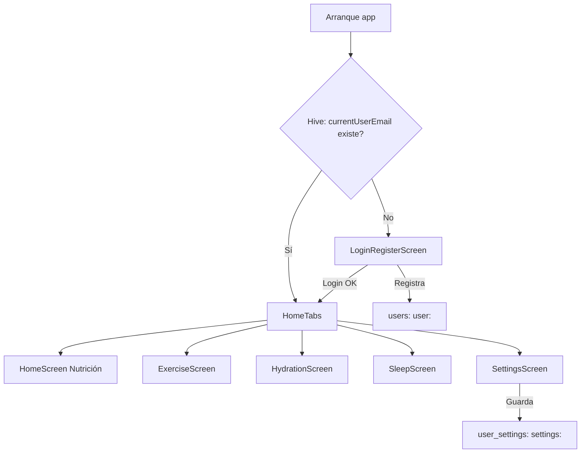
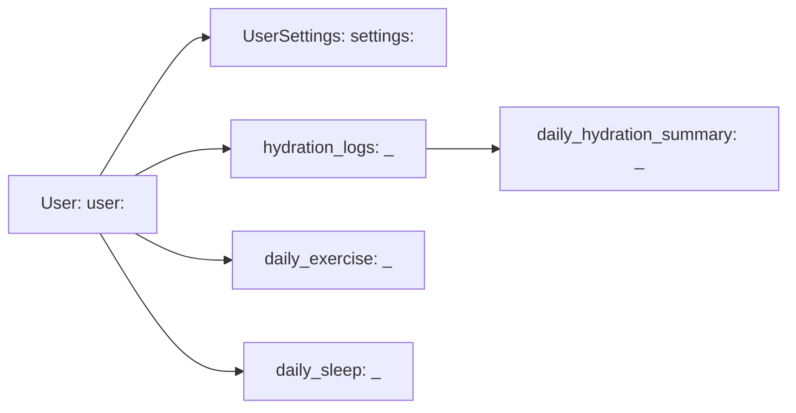

# Vitu - Aplicación Integral de Salud

## 1. Resumen Ejecutivo

Vitu es una aplicación móvil desarrollada con Flutter (Material 3) orientada al seguimiento integral de hábitos y métricas de salud. El proyecto integra módulos funcionales de:

- Nutrición asistida por IA (Google Gemini) con análisis de imágenes de alimentos.
- Ejercicio y movilidad mediante GPS (Geolocator), estimación de distancia y conversión a pasos.
- Hidratación con metas diarias personalizadas, registro por eventos y resumen diario.
- Sueño con registro manual y detección de inactividad dentro de una ventana horaria.
- Preferencias y accesibilidad (modo claro/oscuro, color semilla, tipografía, escala de texto y alto contraste).
- Gestión de usuarios local (registro/inicio de sesión persistente) mediante Hive como base de datos embebida.

El código actual se concentra principalmente en un archivo monolítico: [main.dart](file:///c:/Users/javie/OneDrive/Documentos/GitHub/VidaSaludable/lib/main.dart). Este documento describe de forma técnica y exhaustiva la implementación real del proyecto, sus estructuras de datos, flujo de navegación, módulos, pantallas y consideraciones de configuración para desarrollo y distribución.

## 2. Objetivos del Proyecto

### 2.1 Objetivos Funcionales

1. Proveer un panel centralizado de salud personal con módulos especializados.
2. Permitir personalización del comportamiento y apariencia por usuario.
3. Mantener persistencia local y funcionamiento offline en la mayor parte de las funcionalidades.
4. Integrar capacidades de IA para análisis nutricional y sugerencias de rutinas/recetas.
5. Respetar principios de privacidad al mantener datos en el dispositivo.

### 2.2 Objetivos Técnicos

1. Implementar una arquitectura de persistencia local basada en Hive (NoSQL embebido).
2. Mantener un sistema de tema (ThemeData) dinámico con Material 3 y color semilla configurable.
3. Integrar plugins clave:
   - `google_generative_ai` para Gemini.
   - `geolocator` para ubicación y cálculo de distancias.
   - `image_picker` para adquisición de imágenes.
   - `path_provider` para almacenamiento de archivos.
   - `fl_chart` para visualización de series temporales y progreso.
4. Conservar compatibilidad con Android/iOS dentro del entorno Flutter 3.10.8 (conforme a `environment` en [pubspec.yaml](file:///c:/Users/javie/OneDrive/Documentos/GitHub/VidaSaludable/pubspec.yaml)).

## 3. Alcance y Supuestos

### 3.1 Alcance Incluido (Implementado)

- Persistencia completa de usuarios, preferencias, hidratación, ejercicio y sueño.
- Navegación principal por pestañas (BottomNavigationBar) con `IndexedStack`.
- Integración funcional con Gemini para:
  - Análisis de imagen de comida y extracción de macronutrientes.
  - Sugerencias de recetas y rutinas (según pantallas).
- Seguimiento de ejercicio por GPS con conversión a pasos y guardado diario.
- Recordatorios de hidratación mediante `Timer.periodic` (implementación tipo “mock” con sonido del sistema).

### 3.2 Alcance Parcial o No Implementado (Importante)

- Notificaciones nativas (Android/iOS) con programación persistente: no está implementado. El recordatorio actual reproduce un sonido con `SystemSound.play` mientras la app está en background controlado por flags internos.
- Generación de PDF: no existe implementación en el código actual. Este README define una sección de “diseño propuesto” para alinearse con necesidades de producto, pero se identifica explícitamente como futuro.
- Infraestructura modular por carpetas (clean architecture, BLoC/Provider/Riverpod): no está implementada. El estado se maneja por widgets + callbacks y lectura directa de Hive.

## 4. Stack Tecnológico

### 4.1 Lenguaje y Framework

- Flutter: SDK declarado en [pubspec.yaml](file:///c:/Users/javie/OneDrive/Documentos/GitHub/VidaSaludable/pubspec.yaml) con `sdk: '>=3.1.0 <4.0.0'` (el proyecto indica “Flutter 3.10.8” como referencia en documentación previa).
- Dart: conforme al SDK de Flutter.
- UI: Material 3 (ThemeData + ColorScheme).

### 4.2 Dependencias Principales (Runtime)

Referencias en [pubspec.yaml](file:///c:/Users/javie/OneDrive/Documentos/GitHub/VidaSaludable/pubspec.yaml):

| Paquete | Versión | Uso en Vitu |
|---|---:|---|
| hive | ^2.2.3 | Persistencia local NoSQL (cajas por dominio) |
| hive_flutter | ^1.1.0 | Inicialización de Hive en Flutter |
| path_provider | ^2.1.4 | Rutas de documentos para guardar fotos |
| image_picker | ^1.1.2 | Captura/selección de imagen de comida |
| google_generative_ai | ^0.4.0 | Integración con Gemini (texto e imagen) |
| geolocator | ^12.0.0 | GPS, permisos y cálculo de distancias |
| fl_chart | ^0.68.0 | Gráficas de progreso y series |
| intl | ^0.19.0 | Formateo de fechas y textos |
| url_launcher | ^6.2.5 | Apertura de enlaces externos (p. ej. recursos) |
| shared_preferences | ^2.2.3 | Dependencia declarada; uso limitado/no crítico en main.dart |

### 4.3 Dependencias de Desarrollo

| Paquete | Versión | Uso |
|---|---:|---|
| flutter_test | sdk | Tests (actualmente plantilla por defecto) |
| flutter_lints | ^3.0.0 | Reglas de lint y estilo |

## 5. Arquitectura del Proyecto (Real e Interpretada)

### 5.1 Arquitectura Real (Monolítica por Archivo)

La implementación concentra:

- Modelos de dominio: `User`, `UserSettings` y estructuras auxiliares.
- Persistencia: funciones globales para lectura/escritura en Hive.
- UI: pantallas y widgets en el mismo archivo.
- Controladores (lógica): métodos privados en `State` de cada pantalla (por ejemplo `_analizarConGemini`, `startLocationTracking`, `_startInactivityTracking`, etc.).

La consecuencia directa es que el acoplamiento entre UI y persistencia es alto, y la trazabilidad de cambios se apoya en convenciones de claves Hive y en callbacks entre widgets.

### 5.2 Arquitectura Conceptual (MVC Adaptado a Flutter)

Aunque no existe una separación estricta de carpetas, el sistema puede describirse en términos de MVC:

- Modelo (Model):
  - `User`: perfil, credenciales y datos físicos.
  - `UserSettings`: preferencias de UI/accesibilidad y configuración funcional.
  - Estructuras “persistidas” como mapas/listas que forman logs y resúmenes.
- Vista (View):
  - Widgets de Flutter (pantallas, cards, gráficos, formularios).
- Controlador (Controller):
  - Métodos en los `State` que orquestan lectura/escritura de Hive, cálculos (metas, pasos, horas de sueño), y llamadas a Gemini o Geolocator.

En Vitu, “Controller” y “View” conviven en el mismo `State`, lo cual es común en prototipos avanzados.

### 5.3 Flujo General de Datos

1. Autenticación local:
   - Usuario se registra o inicia sesión.
   - Se persiste `currentUserEmail` en la caja `users`.
2. Carga de preferencias:
   - Al entrar en HomeTabs y/o SettingsScreen, se consultan preferencias de `user_settings`.
3. Operación de módulos:
   - Cada módulo (nutrición, ejercicio, hidratación, sueño) escribe en su caja correspondiente.
4. Renderizado:
   - UI lee de Hive (directa o indirectamente) y renderiza cards/gráficas.

### 5.4 Estado Global y Propagación de Configuración

No se usa un gestor de estado externo (Provider/Riverpod/BLoC). El estado global se logra mediante:

- Variables en el widget de aplicación (MyApp / VidaPlusApp) y en `HomeTabs`.
- `SettingsData` como DTO para notificar cambios desde SettingsScreen a su contenedor.
- Lectura directa del usuario actual mediante `getCurrentUser()` y sus settings con `getSettingsForUser(userId)`.

Fragmento real: `SettingsData` (DTO) y emisión de cambios:

```dart
class SettingsData {
  final Brightness brightness;
  final Color seed;
  final String? fontFamily;
  final bool followLocation;
  const SettingsData({
    required this.brightness,
    required this.seed,
    required this.fontFamily,
    required this.followLocation,
  });
}
```

## 6. Persistencia Local con Hive (Base de Datos)

### 6.1 Principios de Diseño de Persistencia

1. Un usuario se identifica por su correo (`correo`) y se usa como `userId`.
2. Para evitar colisiones, se utiliza un esquema de claves con prefijos:
   - `user:<correo>`
   - `settings:<correo>`
   - `<correo>_<YYYY-MM-DD>` para métricas diarias.
3. Las cajas se abren al inicio de la app:
   - `users`
   - `user_settings`
   - `daily_exercise`
   - `hydration_logs`
   - `daily_hydration_summary`
   - `daily_sleep`

### 6.2 Cajas Hive (Listado Completo)

| Caja | Propósito | Tipo de datos dominante |
|---|---|---|
| `users` | Usuarios, sesión activa, perfil | `Map<String, dynamic>` y `String` |
| `user_settings` | Preferencias por usuario | `Map<String, dynamic>` |
| `daily_exercise` | Registro y resumen de ejercicio | `Map<String, dynamic>` y `List<Map>` |
| `hydration_logs` | Eventos de hidratación por día | `List<Map<String, dynamic>>` |
| `daily_hydration_summary` | Resumen diario de hidratación | `Map<String, dynamic>` |
| `daily_sleep` | Registro de sueño y acumulación | `Map<String, dynamic>` y `double` |

### 6.3 Esquema Detallado: Caja `users`

#### 6.3.1 Claves y Valores

| Clave | Tipo | Descripción |
|---|---|---|
| `currentUserEmail` | `String` | Correo del usuario con sesión activa |
| `user:<correo>` | `Map<String, dynamic>` | Registro del usuario |

#### 6.3.2 Estructura `user:<correo>`

El usuario se serializa como mapa. Campos observados en código (modelo `User`):

| Campo | Tipo | Ejemplo | Observaciones |
|---|---|---|---|
| `nombre` | `String` | `"Ana"` | Requerido para UI |
| `apellido` | `String` | `"Pérez"` | Requerido para UI |
| `genero` | `String` | `"Femenino"` | Usado en personalización |
| `edad` | `int` | `29` | Base para recomendaciones |
| `altura` | `double` | `1.65` | Usado para metas (p. ej. hidratación) |
| `peso` | `double` | `62.5` | Usado para metas (hidratación) |
| `correo` | `String` | `"ana@ejemplo.com"` | Identificador primario |
| `contrasena` | `String` | `"********"` | Guardada localmente (sin hashing) |
| `photoPath` | `String?` | `".../foto.jpg"` | Ruta local, opcional |

Advertencia de seguridad:
La contraseña se guarda en claro en Hive. Para un entorno productivo se recomienda hashing (p. ej., PBKDF2/Argon2) y/o autenticación delegada.

Fragmento real de actualización de contraseña en SettingsScreen:

```dart
final updated = User(
  nombre: u.nombre,
  apellido: u.apellido,
  genero: u.genero,
  edad: u.edad,
  altura: u.altura,
  peso: u.peso,
  correo: u.correo,
  contrasena: newCtrl.text,
  photoPath: u.photoPath,
);
await saveCurrentUser(updated);
```

### 6.4 Esquema Detallado: Caja `user_settings`

#### 6.4.1 Clave y Valor

| Clave | Tipo | Descripción |
|---|---|---|
| `settings:<correo>` | `Map<String, dynamic>` | Preferencias del usuario |

#### 6.4.2 Estructura de `UserSettings`

Campos identificados en `SettingsScreen`, `HydrationScreen` y configuración de tema:

| Campo | Tipo | Descripción | Usado por |
|---|---|---|---|
| `userId` | `String` | Correo del usuario | Persistencia |
| `brightness` | `String?` | `"dark"` o `"light"` | Tema |
| `seedColor` | `int?` | ARGB (p. ej. `0xFF80CBC4`) | Material 3 |
| `fontFamily` | `String?` | `null`, `"serif"`, `"Montserrat"`, `"Poppins"` | Tema |
| `language` | `String?` | `"Español"` / `"English"` | UI (parcial) |
| `followLocation` | `bool?` | Preferencia de ubicación | Ejercicio/contexto |
| `metaHydratationMl` | `int?` | Meta diaria de hidratación (ml) | Hidratación |
| `shareAnonymous` | `bool?` | Compartición anónima (toggle) | Privacidad |
| `pushEnabled` | `bool?` | Habilitar notificaciones (toggle) | Notificaciones |
| `remindersEnabled` | `bool?` | Recordatorios (toggle) | Hidratación |
| `healthAlerts` | `bool?` | Alertas de salud (toggle) | Notificaciones |
| `locationPersonalized` | `bool?` | Personalización por ubicación | Privacidad |
| `highContrast` | `bool?` | Alto contraste | Accesibilidad |
| `notificationFrequency` | `int?` | Frecuencia (interpretación depende del módulo) | Hidratación |
| `textScale` | `double?` | Escala de texto (0.8–1.5) | Accesibilidad |
| `permissions` | `Map<String, dynamic>?` | Flags/estado permisos (placeholder) | Futuro |

Nota importante:
El campo `notificationFrequency` aparece como `int` en SettingsScreen con default `50`, pero en HydrationScreen se interpreta como “horas” y se clampa a `[1,24]` con fallback `2`. Esta discrepancia es un punto de mejora (ver Roadmap).

#### 6.4.3 Migración Interna de Datos (De `users` a `user_settings`)

Al inicializar la app (durante `main()`), se ejecuta una migración que detecta usuarios guardados que poseen campos de apariencia y ubicación dentro del mapa de usuario (`brightness`, `seedColor`, `fontFamily`, `followLocation`) y los mueve a `user_settings`.

Comportamiento real:

1. Recorre todas las claves de `users` que empiezan por `user:`.
2. Extrae valores antiguos y los inserta en settings.
3. Borra campos migrados del mapa de usuario para evitar duplicidad.

Este mecanismo hace la migración idempotente: al ejecutarse múltiples veces, no se duplican datos.

### 6.5 Esquema Detallado: Caja `daily_exercise`

Se usa para dos formas de persistencia:

1. Resumen diario de pasos por fecha.
2. Logs de eventos de ejercicio (inicio/fin con timestamp, distancia, pasos).

#### 6.5.1 Claves

| Clave | Tipo | Descripción |
|---|---|---|
| `<correo>_<YYYY-MM-DD>` | `Map<String, dynamic>` | Resumen del día (pasos, etc.) |
| `exercise_logs:<correo>` | `List<Map<String, dynamic>>` | Historial cronológico de sesiones |

#### 6.5.2 Resumen Diario `<correo>_<YYYY-MM-DD>`

Campos típicos:

| Campo | Tipo | Descripción |
|---|---|---|
| `date` | `String` | Fecha ISO `YYYY-MM-DD` |
| `steps` | `int` | Total de pasos del día (estimado) |
| `distance_m` | `double?` | Distancia acumulada (metros) |
| `updatedAt` | `int` | Timestamp ms |

Nota:
El detalle exacto de campos puede variar según el módulo de ejercicio, dado que se guarda como mapas.

#### 6.5.3 Logs `exercise_logs:<correo>`

Ejemplo conceptual de evento:

| Campo | Tipo | Descripción |
|---|---|---|
| `startTs` | `int` | Inicio (ms) |
| `endTs` | `int` | Fin (ms) |
| `distance_m` | `double` | Distancia del evento |
| `steps` | `int` | Pasos estimados |
| `type` | `String` | Tipo: `"walk"`, `"run"`, etc. (si aplica) |

### 6.6 Esquema Detallado: Caja `hydration_logs`

#### 6.6.1 Clave por Día

| Clave | Tipo | Descripción |
|---|---|---|
| `<correo>_<YYYY-MM-DD>` | `List<Map<String, dynamic>>` | Lista de eventos de hidratación |

#### 6.6.2 Evento de Hidratación (Estructura)

Cada elemento en la lista representa una ingesta:

| Campo | Tipo | Descripción |
|---|---|---|
| `ts` | `int` | Timestamp ms del evento |
| `ml` | `int` | Mililitros ingeridos (positivo) |

### 6.7 Esquema Detallado: Caja `daily_hydration_summary`

#### 6.7.1 Clave por Día

| Clave | Tipo | Descripción |
|---|---|---|
| `<correo>_<YYYY-MM-DD>` | `Map<String, dynamic>` | Resumen de hidratación diaria |

#### 6.7.2 Resumen Diario (Estructura)

Campos típicos:

| Campo | Tipo | Descripción |
|---|---|---|
| `date` | `String` | Fecha ISO |
| `totalMl` | `int` | Total ingerido |
| `goalMl` | `int` | Meta del día (ml) |
| `updatedAt` | `int` | Timestamp ms |

### 6.8 Esquema Detallado: Caja `daily_sleep`

La persistencia de sueño combina:

1. Mapa por día con métricas.
2. Un valor double almacenado con clave alternativa (`sleep_<correo>_<YYYY-MM-DD>`) en la misma caja.

#### 6.8.1 Claves

| Clave | Tipo | Descripción |
|---|---|---|
| `<correo>_<YYYY-MM-DD>` | `Map<String, dynamic>` | Resumen del sueño del día |
| `sleep_<correo>_<YYYY-MM-DD>` | `double` | Horas (o duración) almacenada adicionalmente |

#### 6.8.2 Estructura del Resumen Diario

| Campo | Tipo | Descripción |
|---|---|---|
| `date` | `String` | Fecha ISO |
| `sleepHours` | `double` | Horas totales estimadas |
| `manual` | `bool` | Si el registro proviene de entrada manual |
| `inactiveSegments` | `List<Map>` | Segmentos detectados por inactividad |
| `updatedAt` | `int` | Timestamp ms |

Nota:
El código utiliza ventanas horarias y timers para acumular “sueño” por inactividad; el esquema puede contener estructuras auxiliares.

## 7. Modelos de Dominio (Referencia)

### 7.1 User

Responsabilidad:
Representar al usuario local y su perfil básico.

Campos:

- Identidad: `correo`
- Datos personales: `nombre`, `apellido`, `genero`, `edad`
- Datos físicos: `altura`, `peso`
- Credenciales: `contrasena`
- Multimedia: `photoPath`

Uso:
LoginRegisterScreen, UserProfileEditScreen, SettingsScreen (perfil y seguridad), módulos para metas personalizadas.

### 7.2 UserSettings

Responsabilidad:
Representar preferencias persistentes por usuario.

Campos:
Ver sección 6.4.

Uso:
Theme (brightness, seedColor, fontFamily), accesibilidad (textScale, highContrast), hidratación (metaHydratationMl, notificationFrequency), privacidad (shareAnonymous), ubicación (followLocation, locationPersonalized).

## 8. Estructura del Proyecto (Carpetas y Archivos Clave)

Estructura real observada:

```text
VidaSaludable/
├─ android/
│  ├─ app/
│  │  ├─ src/main/AndroidManifest.xml
│  │  └─ ...
│  └─ ...
├─ ios/
│  ├─ Runner/Info.plist
│  └─ ...
├─ lib/
│  └─ main.dart
├─ test/
│  └─ widget_test.dart
├─ analysis_options.yaml
├─ pubspec.yaml
├─ pubspec.lock
└─ README.md
```

Archivos clave:

- [main.dart](file:///c:/Users/javie/OneDrive/Documentos/GitHub/VidaSaludable/lib/main.dart): fuente principal (modelos, UI, persistencia, IA, GPS).
- [pubspec.yaml](file:///c:/Users/javie/OneDrive/Documentos/GitHub/VidaSaludable/pubspec.yaml): dependencias y assets declarados.
- [AndroidManifest.xml](file:///c:/Users/javie/OneDrive/Documentos/GitHub/VidaSaludable/android/app/src/main/AndroidManifest.xml): permisos de ubicación y configuración Android.
- [Info.plist](file:///c:/Users/javie/OneDrive/Documentos/GitHub/VidaSaludable/ios/Runner/Info.plist): descripciones de uso de ubicación iOS.

## 9. Compilación, Ejecución y Comandos Útiles

### 9.1 Requisitos Previos

- Flutter SDK instalado (alineado con el constraint del proyecto).
- Android Studio / Xcode para toolchains nativas.
- Dispositivo o emulador configurado.
- Conectividad a internet para funcionalidades Gemini.

### 9.2 Instalación y Puesta en Marcha (Paso a Paso)

1. Clonar repositorio:

```bash
git clone <URL_DEL_REPOSITORIO>
cd VidaSaludable
```

2. Instalar dependencias:

```bash
flutter pub get
```

3. Ejecutar en modo debug:

```bash
flutter run
```

4. Limpieza y regeneración (si hay conflictos):

```bash
flutter clean
flutter pub get
```

### 9.3 Comandos de Build (Android)

APK release:

```bash
flutter build apk --release
```

App Bundle (AAB) release:

```bash
flutter build appbundle --release
```

Split por ABI (optimización APK):

```bash
flutter build apk --release --split-per-abi
```

### 9.4 Comandos de Build (iOS)

Build iOS (sin firma para distribución):

```bash
flutter build ios --release
```

Nota:
La distribución iOS requiere configuración en Xcode (Team, Signing, Capabilities) y perfiles adecuados.

### 9.5 Tests (Estado Actual)

El archivo [widget_test.dart](file:///c:/Users/javie/OneDrive/Documentos/GitHub/VidaSaludable/test/widget_test.dart) corresponde a la plantilla de contador de Flutter y referencia `flutter_application_1/main.dart`. Dado que Vitu no implementa el contador por defecto, este test no es representativo y puede fallar.

Para pruebas reales se recomienda:

- Crear tests de serialización para `User` y `UserSettings`.
- Crear tests de cálculo (hidratación y distancia->pasos).
- Crear tests de flujo de login y persistencia de sesión.

Ejecutar tests:

```bash
flutter test
```

### 9.6 Lint y Análisis

Análisis estático:

```bash
flutter analyze
```

## 10. Configuración de Gemini (IA)

### 10.1 Estado de Implementación

La app usa el paquete `google_generative_ai` y configura el modelo en tiempo de ejecución dentro de las pantallas.

Fragmento real (nutrición en HomeScreen, clave incluida en el código actualmente):

```dart
const apiKey = '...';
_geminiModel = GenerativeModel(model: 'gemini-2.5-flash', apiKey: apiKey);
```

Riesgo:
Incluir una API key en el repositorio expone credenciales y rompe mejores prácticas.

### 10.2 Configuración Recomendada (Producción)

Usar `--dart-define` para inyectar la key sin versionarla:

1. Definir en ejecución:

```bash
flutter run --dart-define=GEMINI_API_KEY=<TU_API_KEY>
```

2. Leer desde código (diseño recomendado):

```dart
const apiKey = String.fromEnvironment('GEMINI_API_KEY');
```

3. Validación:
Si `apiKey` es vacío, mostrar un mensaje y deshabilitar módulos de IA.

### 10.3 Modelos y Límites

Modelo configurado en el código:

- `gemini-2.5-flash` (texto + multimodal).

Observación:
Existe un `debugPrint("Intentando ping con modelo: gemini-pro-vision");` aunque el modelo usado es `gemini-2.5-flash`. Esta inconsistencia es solo log, pero conviene alinearla.

## 11. Permisos y Configuración de Plataforma

### 11.1 Android

Archivo: [AndroidManifest.xml](file:///c:/Users/javie/OneDrive/Documentos/GitHub/VidaSaludable/android/app/src/main/AndroidManifest.xml)

Permisos relevantes:

- `ACCESS_FINE_LOCATION`
- `ACCESS_COARSE_LOCATION`

Uso:
Módulo de ejercicio y cualquier lógica contextual que dependa de GPS.

### 11.2 iOS

Archivo: [Info.plist](file:///c:/Users/javie/OneDrive/Documentos/GitHub/VidaSaludable/ios/Runner/Info.plist)

Claves observadas:

- `NSLocationWhenInUseUsageDescription`
- `NSLocationAlwaysAndWhenInUseUsageDescription`

Permisos adicionales recomendados para `image_picker` (si se habilita cámara/galería en iOS):

- `NSCameraUsageDescription`
- `NSPhotoLibraryUsageDescription`
- `NSPhotoLibraryAddUsageDescription`

## 12. Sistema de Temas y Accesibilidad

### 12.1 Objetivo de Diseño

El sistema de tema busca:

- Soportar modo oscuro/claro.
- Mantener consistencia visual por usuario.
- Permitir personalización de color semilla (Material 3).
- Permitir tipografía preferida.
- Exponer accesibilidad global con escala de texto y alto contraste.

### 12.2 Componentes Técnicos

- `ThemeData` con `useMaterial3: true`.
- `ColorScheme.fromSeed(seedColor: ...)` para generar paletas.
- Propagación por `Theme` y `MediaQuery.copyWith(...)` para accesibilidad.

Fragmento real: aplicación de escala de texto y alto contraste a nivel global:

```dart
return MediaQuery(
  data: mq.copyWith(
    textScaler: TextScaler.linear(_textScale),
    highContrast: _highContrast,
  ),
  child: Theme(
    data: theme,
    child: Scaffold(
      body: IndexedStack(index: _index, children: pages),
    ),
  ),
);
```

### 12.3 Tipografías (fontFamily)

Opciones expuestas en SettingsScreen:

- `null` (sistema)
- `"serif"`
- `"Montserrat"`
- `"Poppins"`

Nota:
Si una familia no está incluida como asset de fuente en Flutter, el motor hará fallback a la fuente disponible. Para garantizar exactitud se recomienda declarar fuentes en `pubspec.yaml`.

### 12.4 Color Semilla (Seed)

SettingsScreen define una paleta de presets:

- Amarillo `0xFFFFECB3`
- Lima `0xFFC5E1A5`
- Verde `0xFFA5D6A7`
- Azul `0xFF90CAF9`
- Rojo `0xFFEF9A9A`
- Morado `0xFFCE93D8`

Además, la UI usa helpers HSL para lighten/darken/saturate y estilos con `WidgetStateProperty.resolveWith`.

## 13. Navegación y Pantallas (Referencia Completa)

### 13.1 Splash / Entrada

Responsabilidad:

- Mostrar animación inicial.
- Determinar si existe sesión (`currentUserEmail`).
- Redirigir a:
  - `HomeTabs` si hay usuario autenticado.
  - `LoginRegisterScreen` si no hay sesión.

Aspectos técnicos:

- Uso de `AnimationController`.
- Navegación con `pushReplacement` o `pushAndRemoveUntil` para reset de stack.

### 13.2 LoginRegisterScreen (Autenticación Local)

Responsabilidad:

- Registro de usuario (persistencia en Hive `users`).
- Inicio de sesión (validación local).
- Escritura de `currentUserEmail`.

Flujo:

1. Usuario ingresa correo y contraseña.
2. Si modo registro:
   - Solicita datos adicionales.
   - Crea `User`.
   - Guarda en `users` con clave `user:<correo>`.
3. Si modo login:
   - Lee `user:<correo>`.
   - Verifica contraseña.
4. En éxito:
   - Guarda `currentUserEmail`.
   - Navega a HomeTabs.

Consideración:
No existe hashing ni “forgot password”. La recuperación no está implementada.

### 13.3 HomeTabs (Navegación Principal)

Responsabilidad:

- Mantener índice de pestaña.
- Renderizar páginas con `IndexedStack` para conservar estado interno.
- Aplicar Theme y MediaQuery globales de accesibilidad.

Pestañas observadas:

- Nutrición (HomeScreen)
- Ejercicio (ExerciseScreen)
- Hidratación (HydrationScreen)
- Sueño (SleepScreen)
- Ajustes (SettingsScreen)

Además se accede a pantallas secundarias como:

- PresentationScreen
- MagazineHomeScreen
- RoutineSuggestionScreen
- UserProfileEditScreen

### 13.4 HomeScreen (Nutrición con IA)

Responsabilidad:

- Captura/selección de foto de comida.
- Guardado local de la imagen en Documents Directory.
- Envío de imagen + prompt a Gemini.
- Parseo de respuesta en formato fijo para extraer:
  - Plato
  - Calorías
  - Proteínas
  - Carbohidratos
  - Grasas
- Mostrar recomendación y recetas.

#### 13.4.1 Flujo de Captura y Guardado

1. El usuario elige fuente (cámara o galería).
2. `image_picker` devuelve `XFile`.
3. Se copia a Documents Directory con nombre `vitu_food_<ts>.jpg`.
4. Se guarda en `_savedPhotos` para historial inmediato.

Fragmento real:

```dart
final dir = await getApplicationDocumentsDirectory();
final ts = DateTime.now().millisecondsSinceEpoch;
final path = '${dir.path}/vitu_food_$ts.jpg';
final file = File(path);
await file.writeAsBytes(await xfile.readAsBytes());
setState(() {
  _photo = file;
  _savedPhotos.insert(0, file);
});
```

#### 13.4.2 `_analizarConGemini(File foto)`

Objetivo:
Enviar imagen y prompt a Gemini y extraer macronutrientes.

Precondiciones:

- El archivo existe.
- El tamaño del archivo es > 0.

Salida:

- Actualiza `_plato`, `_kcal`, `_prot`, `_carb`, `_fat`.

Fragmento real (extracto representativo):

```dart
final bytes = await foto.readAsBytes();
final lower = foto.path.toLowerCase();
final mime = lower.endsWith('.png') ? 'image/png' : 'image/jpeg';
final content = Content.multi([TextPart(prompt), DataPart(mime, bytes)]);
final resp = await _geminiModel
    .generateContent([content])
    .timeout(const Duration(seconds: 20));
final text = resp.text ?? '';
```

Contrato de formato:
El prompt exige un formato exacto de respuesta, lo que permite parseo determinístico. Ejemplo esperado:

```text
Plato: Pollo a la plancha con ensalada
Calorías: 540 kcal
Proteínas: 45 g
Carbohidratos: 35 g
Grasas: 22 g
```

#### 13.4.3 `_cargarRecetasRecomendadas()`

Objetivo:
Construir recomendaciones de recetas (posiblemente en base a preferencias del usuario) y poblar `_recetasRecomendadas`.

Notas:
La pantalla invoca esta carga al iniciar (`Future.microtask(_cargarRecetasRecomendadas);`). La estrategia exacta puede combinar:

- Listas estáticas.
- Llamadas a Gemini para recetas (según implementación).

### 13.5 ExerciseScreen (Ejercicio con GPS)

Responsabilidad:

- Solicitar permisos de ubicación.
- Iniciar tracking con Geolocator.
- Calcular distancia incremental entre posiciones sucesivas.
- Convertir distancia a pasos con longitud de zancada fija.
- Persistir resultado diario en Hive `daily_exercise`.

#### 13.5.1 Conversión Distancia a Pasos

Supuesto:
Longitud de paso constante:

- `_stepLengthMeters = 0.75`

Fragmentos reales:

```dart
int distanceToSteps(double meters) {
  if (meters <= 0) return 0;
  return (meters / _stepLengthMeters).floor();
}

double calculateDistance(Position a, Position b) {
  return Geolocator.distanceBetween(
    a.latitude,
    a.longitude,
    b.latitude,
    b.longitude,
  );
}
```

Implicación:
El conteo de pasos es una estimación. Para precisión real se requeriría integración con sensores (pedometer/health APIs).

#### 13.5.2 Tracking de Ubicación: `startLocationTracking()`

Objetivo:
Iniciar un stream de posiciones y acumular distancia.

Puntos técnicos:

- Manejo de permisos con Geolocator.
- Control de estado `mounted`.
- Gestión de suscripciones para evitar fugas.

Persistencia:

- Se guarda en `daily_exercise` con clave `<correo>_<date>`.
- Se opcionaliza el guardado de logs `exercise_logs:<correo>`.

### 13.6 HydrationScreen (Hidratación y Recordatorios)

Responsabilidad:

- Calcular meta diaria (ml) a partir del usuario y/o settings persistidos.
- Permitir al usuario registrar consumo incremental.
- Persistir eventos y resumen diario.
- Mostrar progreso circular y gráficos semanales.
- Programar recordatorios periódicos (mock).

#### 13.6.1 Meta Diaria

Reglas:

- Preferencia `metaHydratationMl` en settings tiene prioridad.
- Si no existe, se calcula mediante `computeDailyHydrationGoalMl(u)`.

#### 13.6.2 Registro de Hidratación: `addHydrationMl(...)`

Propósito:

- Agregar un evento (ts, ml) al log diario.
- Recalcular total y guardar resumen diario.

Fragmento real:

```dart
Future<void> addHydrationMl({
  required String userId,
  required int ml,
  DateTime? when,
  required int goalMl,
}) async {
  final date = (when ?? DateTime.now());
  final key = '${userId}_${_toYmd(date)}';
  final logs = (_hydrationLogsBox.get(key) as List?)?.cast<Map>() ?? <Map>[];
  logs.add({'ts': date.millisecondsSinceEpoch, 'ml': ml});
  await _hydrationLogsBox.put(key, logs);
  final total = logs.fold<int>(0, (acc, e) => acc + (e['ml'] as int? ?? 0));
  await _dailyHydrationSummaryBox.put(key, {
    'date': _toYmd(date),
    'totalMl': total,
    'goalMl': goalMl,
    'updatedAt': DateTime.now().millisecondsSinceEpoch,
  });
}
```

#### 13.6.3 Recordatorios: `_syncReminderTimer()`

Implementación actual:

- Usa `Timer.periodic` con intervalo en horas.
- Solo “activa” recordatorios bajo ciertas condiciones internas (`_inBackground`, `_reminderHours > 0`).
- En lugar de notificación nativa, reproduce un sonido:

```dart
_reminderTimer = Timer.periodic(Duration(hours: _reminderHours), (_) {
  if (!mounted) return;
  SystemSound.play(SystemSoundType.alert);
});
```

Limitación crítica:
Los timers no garantizan ejecución en background prolongado (depende del sistema). Para producción se requiere notificaciones locales programadas y/o background services según plataforma.

### 13.7 SleepScreen (Sueño: Manual + Inactividad)

Responsabilidad:

- Registrar sueño manual (horas).
- Detectar inactividad del usuario dentro de una ventana horaria (ej. noche).
- Acumular segmentos de inactividad como aproximación de sueño.
- Persistir resumen diario en `daily_sleep`.

#### 13.7.1 Detección de Inactividad: `_startInactivityTracking()`

Comportamiento real:

- Timer de 1 minuto.
- Si está dentro de ventana horaria (`_inWindow(now)`), evalúa diferencia entre `now` y `_lastInteractionTs`.
- Si supera 30 minutos, fija `_inactiveStart` y considera ese intervalo como potencial sueño.

Fragmento real:

```dart
_inactivityTimer = Timer.periodic(const Duration(minutes: 1), (_) {
  final now = DateTime.now();
  if (!_inWindow(now)) {
    _inactiveStart = null;
    return;
  }
  _lastInteractionTs ??= now;
  final diff = now.difference(_lastInteractionTs!);
  if (diff.inMinutes >= 30) {
    _inactiveStart ??= _lastInteractionTs;
  }
});
```

#### 13.7.2 Corte Diario (8:00 AM)

Existe una lógica de corte diario para cerrar el “día de sueño” y evitar arrastrar inactividad. Este comportamiento permite que el sueño nocturno se asigne correctamente a la fecha, independientemente de la hora de finalización.

#### 13.7.3 Persistencia de Sueño

- Clave: `<correo>_<YYYY-MM-DD>` en `daily_sleep`.
- Resumen con horas y metadata.
- Persistencia secundaria: `sleep_<correo>_<YYYY-MM-DD>` como `double`.

Punto de mejora:
Unificar en una sola representación y eliminar duplicidad.

### 13.8 SettingsScreen (Ajustes, Perfil, Seguridad y Accesibilidad)

Responsabilidad:

- Edición de apariencia: tema, color semilla, tipografía.
- Preferencias generales: idioma.
- Seguridad: cambio de contraseña y cierre de sesión.
- Privacidad y notificaciones: toggles (shareAnonymous, pushEnabled, etc.).
- Accesibilidad: alto contraste, escala de texto.
- Persistencia inmediata: cada cambio se guarda en `user_settings`.

#### 13.8.1 Cambio de Fuente: `_onFontSegmentChanged(...)`

Comportamiento:

- Si se selecciona `system`, se define `_fontFamily = null`.
- Para serif/Montserrat/Poppins, se abre un diálogo y se persiste selección.

Fragmento real (extracto de persistencia):

```dart
saveSettings(
  UserSettings(
    userId: u.correo,
    seedColor: prev?.seedColor ?? colorToArgb(_seed),
    fontFamily: _fontFamily,
    metaHydratationMl: prev?.metaHydratationMl ?? computeDailyHydrationGoalMl(u),
    notificationFrequency: prev?.notificationFrequency ?? _notifFreq,
    textScale: prev?.textScale ?? _textScale,
  ),
);
```

#### 13.8.2 Cierre de Sesión

Implementación:

- Elimina `currentUserEmail` de `users`.
- Redirige a `LoginRegisterScreen` y limpia stack:

```dart
await _usersBox.delete('currentUserEmail');
nav.pushAndRemoveUntil(
  MaterialPageRoute(builder: (_) => const LoginRegisterScreen()),
  (route) => false,
);
```

### 13.9 UserProfileEditScreen (Edición de Perfil)

Responsabilidad:

- Editar datos del usuario: nombre, apellido, género, edad, altura, peso.
- Gestionar foto de perfil (según implementación).
- Persistir cambios en `users` bajo `user:<correo>`.

Relación:
Sus cambios afectan:

- Cálculo de meta de hidratación.
- Personalización de prompts de IA.

### 13.10 RoutineSuggestionScreen (Rutinas con IA)

Responsabilidad:

- Generar sugerencias de rutina (fuerza/yoga/estiramiento, etc.).
- Consultar Gemini con prompt personalizado.
- Mostrar resultados en UI.

Consideración:
Similar a HomeScreen, usa API key de Gemini. Se recomienda unificar inyección de clave y un solo “GeminiClient”.

### 13.11 PresentationScreen

Responsabilidad:

- Pantalla de presentación/introducción con navegación hacia módulos.
- Proporciona contexto y onboarding visual.

### 13.12 MagazineHomeScreen (Contenido/Artículos)

Responsabilidad:

- Mostrar contenido tipo magazine: artículos, tips, recursos.
- Acciones de navegación hacia vistas secundarias y enlaces.

## 14. Módulos Funcionales en Profundidad

### 14.1 Módulo de Nutrición con IA (Gemini)

#### 14.1.1 Objetivo

Transformar una fotografía de comida en un resumen nutricional aproximado y en recomendaciones accionables.

#### 14.1.2 Pipeline Técnico

1. Adquisición de imagen (cámara/galería).
2. Normalización (guardado local y detección MIME).
3. Construcción de prompt:
   - Formato estrictamente parseable.
   - Posible personalización con datos del usuario (edad/peso/objetivo).
4. Envío multimodal:
   - `Content.multi([TextPart(prompt), DataPart(mime, bytes)])`
5. Recepción y parseo:
   - Extracción por líneas y patrones `Campo: valor`.
6. Renderizado:
   - Card con plato/macros.
   - Gráfico o tabla (si aplica).

#### 14.1.3 Control de Errores

Casos tratados:

- Imagen vacía: se aborta análisis y se ofrece retry.
- Timeout: `.timeout(Duration(seconds: 20))`
- Excepciones `GenerativeAIException`: se informa al usuario.
- Falta de conectividad: `SocketException`.

#### 14.1.4 Limitaciones

- Estimaciones aproximadas: la IA no puede garantizar valores exactos sin contexto.
- Sesgo por porción y ángulo de foto.
- Dependencia de conectividad y cuota.

### 14.2 Módulo de Ejercicio (GPS + Estimación de Pasos)

#### 14.2.1 Objetivo

Estimular actividad física registrando caminatas/carreras mediante GPS y traduciendo distancia a pasos estimados.

#### 14.2.2 Pipeline Técnico

1. Solicitud de permisos de ubicación.
2. Suscripción a stream de posiciones.
3. Cálculo de distancia incremental:
   - `Geolocator.distanceBetween`.
4. Acumulación:
   - Distancia total en metros.
   - Pasos = `floor(meters / 0.75)`.
5. Persistencia por día.
6. Visualización:
   - Gráficas semanales (fl_chart).
   - Resumen actual.

#### 14.2.3 Consideraciones de Precisión

- GPS tiene ruido; se recomienda filtrar por precisión y velocidad.
- La zancada fija varía por altura, velocidad y género; idealmente se calcula por usuario o se calibra.

### 14.3 Módulo de Hidratación (Metas + Eventos + Recordatorios)

#### 14.3.1 Objetivo

Ayudar a mantener una ingesta hídrica diaria adecuada.

#### 14.3.2 Modelo de Datos

- Eventos: lista de `{ts, ml}` por día.
- Resumen: `{totalMl, goalMl}` por día.

#### 14.3.3 UX del Registro

- Botones y slider para añadir agua en incrementos.
- Indicador circular de progreso.
- Acceso a historial diario.

#### 14.3.4 Recordatorios (Estado Actual vs Recomendado)

Estado actual:

- Timer + sonido.
- No persistente ante cierres de app.

Recomendado:

- Notificaciones locales con programación.
- Persistencia de schedule por usuario.
- Control “quiet hours” y frecuencia por ventana.

### 14.4 Módulo de Sueño (Manual + Detección por Inactividad)

#### 14.4.1 Objetivo

Registrar duración de sueño de manera simple con soporte de automatización aproximada.

#### 14.4.2 Detección por Inactividad

Heurística implementada:

- Si el usuario no interactúa por >= 30 min en ventana nocturna, se considera un segmento de inactividad.

Importante:
Esta heurística mide inactividad de la app, no inactividad física del dispositivo, por lo que:

- Puede subestimar si el usuario no abre la app.
- Puede sobreestimar si deja la app abierta.

#### 14.4.3 Corte Diario

El corte a las 8:00 AM evita que el día “se alargue” y permite cierre de segmentos.

## 15. Referencia Técnica de Funciones Principales (main.dart)

Esta sección lista funciones relevantes y su papel en el sistema. Los nombres se toman del código real y reflejan comportamiento en runtime.

### 15.1 IA / Gemini

- `_analizarConGemini(File foto)`:
  - Entrada: archivo de imagen.
  - Salida: macros y nombre del plato.
  - Efectos: actualiza estado UI, muestra snackbars, hace llamadas a red.
- `_cargarRecetasRecomendadas()`:
  - Entrada: estado actual + usuario (implícito).
  - Salida: lista de `_Receta` para UI.
- `_fetchSuggestions()` (en rutinas o recomendaciones):
  - Entrada: prompt parametrizado.
  - Salida: texto/estructura con recomendaciones.

### 15.2 Hidratación

- `addHydrationMl({required String userId, required int ml, DateTime? when, required int goalMl})`:
  - Persistencia: `hydration_logs` y `daily_hydration_summary`.
  - Idempotencia: no; cada llamada agrega un evento.
- `_syncReminderTimer()`:
  - Orquesta timers según configuración y estado de la app.
- `_loadToday()`:
  - Lee logs/resumen del día y reconstruye el estado.

### 15.3 Ejercicio

- `startLocationTracking()`:
  - Solicita permisos y suscribe al stream.
  - Acumula distancia y pasos.
- `calculateDistance(Position a, Position b)`:
  - Distancia geodésica.
- `distanceToSteps(double meters)`:
  - Conversión estimada.

### 15.4 Sueño

- `_startInactivityTracking()`:
  - Inicia timer de análisis de inactividad.
- `_inWindow(DateTime now)`:
  - Determina si se evalúa inactividad.
- `_accumulateSleep(...)` (acumulación diaria):
  - Convierte segmentos a horas.
- `_scheduleDailyCutoff()`:
  - Programa corte 8:00 AM.

### 15.5 Usuario / Sesión

- `getCurrentUser()`:
  - Lee `currentUserEmail` y luego `user:<correo>`.
- `saveCurrentUser(User u)`:
  - Persiste perfil.
- `getSettingsForUser(String userId)`:
  - Lee `settings:<correo>`.
- `saveSettings(UserSettings s)`:
  - Persiste preferencia.

## 16. Seguridad, Privacidad y Cumplimiento

### 16.1 Almacenamiento Local

Datos sensibles guardados en el dispositivo:

- Credenciales (contraseña en claro).
- Foto de perfil (ruta local).
- Registros de salud (hidratación, sueño, ejercicio).

Recomendaciones:

1. Hash de contraseña y no guardar en claro.
2. Cifrado de Hive (Hive AES) para datos sensibles.
3. Opción de “borrar datos” por usuario.

### 16.2 Uso de Ubicación

Uso:

- Ejercicio (distancia y rutas).

Buenas prácticas:

- Solicitar solo “When In Use”.
- Explicar finalidad en UI.
- Permitir desactivación total (ya existe `followLocation`).

### 16.3 IA y Datos

El análisis de imágenes implica enviar contenido a un servicio externo (Gemini).

Recomendaciones:

- Aviso de privacidad explícito.
- Consentimiento del usuario.
- Posibilidad de desactivar IA.

## 17. Configuración Avanzada de Release

### 17.1 Android Keystore (Referencia)

Pasos típicos:

1. Crear keystore:

```bash
keytool -genkey -v -keystore keystore.jks -keyalg RSA -keysize 2048 -validity 10000 -alias vitu
```

2. Configurar `key.properties` (no versionar).
3. Configurar `android/app/build.gradle` con signingConfigs.

Nota:
No incluir claves en repositorio.

### 17.2 Variables de Entorno y `--dart-define`

Para evitar secretos:

- `GEMINI_API_KEY`
- Flags de entorno (p. ej. `VITU_ENV=prod`)

Ejemplo:

```bash
flutter build apk --release --dart-define=GEMINI_API_KEY=<TU_API_KEY>
```

## 18. Troubleshooting (Problemas Comunes)

### 18.1 “Gemini ping failed”

Causas probables:

- API key inválida o revocada.
- Sin internet.
- Cuota agotada.
- Modelo no disponible para la región.

Acciones:

- Verificar clave en `https://aistudio.google.com/app/apikey`.
- Revisar conectividad del dispositivo.
- Probar con un prompt corto y revisar logs.

### 18.2 “Location permission denied”

Acciones:

- Conceder permisos en Ajustes del sistema.
- Verificar manifest/plist.
- Verificar configuración de Geolocator.

### 18.3 iOS no abre cámara/galería

Acción:

- Añadir descripciones `NSCameraUsageDescription` y `NSPhotoLibraryUsageDescription` en Info.plist.

### 18.4 Persistencia no refleja cambios

Acciones:

- Borrar datos de app (solo en debug).
- Revisar claves Hive (`settings:<correo>`, `user:<correo>`).
- Confirmar que el correo coincide exactamente (case-sensitive).

## 19. Roadmap y Mejoras Futuras (Propuesta)

### 19.1 Arquitectura

1. Separar `lib/` en módulos:
   - `models/`
   - `services/`
   - `screens/`
   - `widgets/`
2. Introducir un gestor de estado:
   - Riverpod o BLoC para desacoplar UI y persistencia.
3. Introducir repositorios:
   - `UserRepository`, `HydrationRepository`, etc.

### 19.2 Persistencia

1. Definir `TypeAdapter` de Hive para `User` y `UserSettings`.
2. Versionar esquemas y migraciones explícitas.
3. Cifrado de cajas sensibles.

### 19.3 Notificaciones

1. Implementar `flutter_local_notifications`.
2. Programación persistente de recordatorios con canales Android.
3. “Quiet hours” y configuración por usuario.

### 19.4 Ejercicio

1. Filtrado de ruido GPS.
2. Calibración de longitud de paso por usuario.
3. Integración con pedómetro / HealthKit / Google Fit (según plataforma).

### 19.5 Sueño

1. Integración con sensores y/o Health APIs.
2. Mejor heurística: considerar movimiento y bloqueo de pantalla.
3. Consolidación de schema en `daily_sleep`.

### 19.6 Nutrición

1. Cache de resultados por hash de imagen.
2. Mejor parseo con JSON estructurado (solicitar a Gemini salida JSON).
3. Modo offline parcial (biblioteca de alimentos básica).

### 19.7 Generación de PDF (Diseño Propuesto)

Estado:
No implementado en el código actual.

Objetivo propuesto:
Exportar reportes semanales/mensuales de:

- Hidratación (totales y cumplimiento).
- Ejercicio (pasos/distancia).
- Sueño (horas).
- Nutrición (macros estimados).

Diseño sugerido (ejemplo conceptual):

```dart
// Diseño propuesto (no existe en main.dart actual)
Future<Uint8List> buildWeeklyReportPdf(WeeklyReport data) async {
  // 1) Componer páginas con gráficos y tablas
  // 2) Renderizar a bytes (pdf)
  // 3) Retornar para compartir/guardar
  throw UnimplementedError();
}
```

## 20. Glosario

- ARGB: representación de color con Alpha, Red, Green, Blue.
- DTO: objeto de transferencia de datos (p. ej. SettingsData).
- Hive Box: contenedor clave-valor persistente.
- IndexedStack: widget que mantiene estados de hijos no visibles.
- Material 3: sistema de diseño con color dinámico y componentes modernizados.
- MIME: tipo de contenido (p. ej. `image/jpeg`).
- Prompt: instrucción textual enviada a un modelo generativo.
- Seed color: color semilla usado para derivar un ColorScheme.
- Timestamp ms: milisegundos desde epoch (Unix).

## 21. Licencia

Este repositorio no incluye un archivo LICENSE explícito en la estructura observada. Para proyectos open-source se recomienda incorporar una licencia formal.

Licencia sugerida (MIT, texto de referencia):

Copyright (c) 2026

Se concede permiso, de forma gratuita, a cualquier persona que obtenga una copia
de este software y de los archivos de documentación asociados (el "Software"), para
utilizar el Software sin restricción, incluyendo, sin limitación, los derechos
de usar, copiar, modificar, fusionar, publicar, distribuir, sublicenciar y/o vender
copias del Software, y para permitir a las personas a las que se les proporcione el Software
hacer lo mismo, sujeto a las siguientes condiciones:

El aviso de copyright anterior y este aviso de permiso se incluirán en todas
las copias o partes sustanciales del Software.

EL SOFTWARE SE PROPORCIONA "TAL CUAL", SIN GARANTÍA DE NINGÚN TIPO, EXPRESA O
IMPLÍCITA, INCLUYENDO, PERO NO LIMITADO A, LAS GARANTÍAS DE COMERCIABILIDAD,
IDONEIDAD PARA UN PROPÓSITO PARTICULAR Y NO INFRACCIÓN. EN NINGÚN CASO LOS
AUTORES O TITULARES DE LOS DERECHOS DE AUTOR SERÁN RESPONSABLES POR CUALQUIER RECLAMO,
DAÑOS U OTRA RESPONSABILIDAD, YA SEA EN UNA ACCIÓN DE CONTRATO, AGRAVIO O DE
OTRA MANERA, QUE SURJA DE O EN CONEXIÓN CON EL SOFTWARE O EL USO U OTROS TRATOS
EN EL SOFTWARE.

## 22. Créditos

### 22.1 Tecnologías y Librerías

- Flutter y Dart (Google).
- Hive (base de datos local).
- Google Generative AI SDK (`google_generative_ai`).
- Geolocator.
- fl_chart.
- image_picker.
- path_provider.

### 22.2 Atribuciones de Producto

- “Vitu” se presenta como una aplicación integral de salud con enfoque educativo y de bienestar.
- Los resultados de IA son aproximaciones y no sustituyen asesoramiento médico.

## 23. Apéndice A: Convenciones de Claves Hive (Especificación)

Esta especificación describe las convenciones reales usadas en el proyecto y su interpretación recomendada.

### 23.1 Prefijos

| Prefijo | Ejemplo | Caja | Significado |
|---|---|---|---|
| `user:` | `user:ana@ejemplo.com` | `users` | Registro del usuario |
| `settings:` | `settings:ana@ejemplo.com` | `user_settings` | Preferencias del usuario |
| `exercise_logs:` | `exercise_logs:ana@ejemplo.com` | `daily_exercise` | Historial de sesiones |

### 23.2 Claves Diarias (YYYY-MM-DD)

Formato:

```text
<correo>_<YYYY-MM-DD>
```

Ejemplos:

```text
ana@ejemplo.com_2026-03-14
carlos@empresa.com_2026-12-01
```

Uso por caja:

| Caja | Contenido bajo `<correo>_<date>` |
|---|---|
| `daily_exercise` | Resumen de pasos/distancia del día |
| `hydration_logs` | Lista de eventos `{ts, ml}` del día |
| `daily_hydration_summary` | Resumen `{totalMl, goalMl}` del día |
| `daily_sleep` | Resumen de sueño del día |

## 24. Apéndice B: Ejemplos de Datos Persistidos (JSON Conceptual)

Los siguientes ejemplos están expresados en JSON conceptual para facilitar inspección. En Hive se almacenan como mapas/listas nativas de Dart.

### 24.1 Usuario (`users` / `user:<correo>`)

```json
{
  "nombre": "Ana",
  "apellido": "Pérez",
  "genero": "Femenino",
  "edad": 29,
  "altura": 1.65,
  "peso": 62.5,
  "correo": "ana@ejemplo.com",
  "contrasena": "********",
  "photoPath": "C:/.../profile_ana.jpg"
}
```

### 24.2 Settings (`user_settings` / `settings:<correo>`)

```json
{
  "userId": "ana@ejemplo.com",
  "brightness": "dark",
  "seedColor": 4286613962,
  "fontFamily": "Poppins",
  "language": "Español",
  "followLocation": true,
  "metaHydratationMl": 2200,
  "shareAnonymous": false,
  "pushEnabled": false,
  "remindersEnabled": true,
  "healthAlerts": false,
  "locationPersonalized": false,
  "highContrast": false,
  "notificationFrequency": 2,
  "textScale": 1.0
}
```

### 24.3 Hidratación (`hydration_logs` / `<correo>_<date>`)

```json
[
  { "ts": 1773500000000, "ml": 250 },
  { "ts": 1773503600000, "ml": 300 }
]
```

### 24.4 Resumen de Hidratación (`daily_hydration_summary` / `<correo>_<date>`)

```json
{
  "date": "2026-03-14",
  "totalMl": 550,
  "goalMl": 2200,
  "updatedAt": 1773507200000
}
```

### 24.5 Sueño (`daily_sleep` / `<correo>_<date>`)

```json
{
  "date": "2026-03-14",
  "sleepHours": 6.5,
  "manual": false,
  "inactiveSegments": [
    { "startTs": 1773460000000, "endTs": 1773480000000 }
  ],
  "updatedAt": 1773507200000
}
```

## 25. Apéndice C: Diagramas (Mermaid)

### 25.1 Flujo de Sesión



### 25.2 Persistencia por Módulo



## 26. Apéndice D: Checklist de Release (Operativo)

1. Eliminar credenciales hardcodeadas (API key de Gemini).
2. Verificar permisos Android/iOS (ubicación, cámara/galería).
3. Ejecutar análisis:
   - `flutter analyze`
4. Ejecutar tests:
   - `flutter test`
5. Validar build Android:
   - `flutter build apk --release`
6. Validar build iOS:
   - `flutter build ios --release`
7. Verificar persistencia Hive en ejecución real (instalación limpia).
8. Revisar tamaño final y assets.

- `gemini-2.5-flash` (texto + multimodal).

Observación:
Existe un `debugPrint("Intentando ping con modelo: gemini-pro-vision");` aunque el modelo usado es `gemini-2.5-flash`. Esta inconsistencia es solo log, pero conviene alinearla.

## 11. Permisos y Configuración de Plataforma

### 11.1 Android

Archivo: [AndroidManifest.xml](file:///c:/Users/javie/OneDrive/Documentos/GitHub/VidaSaludable/android/app/src/main/AndroidManifest.xml)

Permisos relevantes:

- `ACCESS_FINE_LOCATION`
- `ACCESS_COARSE_LOCATION`

Uso:
Módulo de ejercicio y cualquier lógica contextual que dependa de GPS.

### 11.2 iOS

Archivo: [Info.plist](file:///c:/Users/javie/OneDrive/Documentos/GitHub/VidaSaludable/ios/Runner/Info.plist)

Claves observadas:

- `NSLocationWhenInUseUsageDescription`
- `NSLocationAlwaysAndWhenInUseUsageDescription`

Permisos adicionales recomendados para `image_picker` (si se habilita cámara/galería en iOS):

- `NSCameraUsageDescription`
- `NSPhotoLibraryUsageDescription`
- `NSPhotoLibraryAddUsageDescription`

## 12. Sistema de Temas y Accesibilidad

### 12.1 Objetivo de Diseño

El sistema de tema busca:

- Soportar modo oscuro/claro.
- Mantener consistencia visual por usuario.
- Permitir personalización de color semilla (Material 3).
- Permitir tipografía preferida.
- Exponer accesibilidad global con escala de texto y alto contraste.

### 12.2 Componentes Técnicos

- `ThemeData` con `useMaterial3: true`.
- `ColorScheme.fromSeed(seedColor: ...)` para generar paletas.
- Propagación por `Theme` y `MediaQuery.copyWith(...)` para accesibilidad.

Fragmento real: aplicación de escala de texto y alto contraste a nivel global:

```dart
return MediaQuery(
  data: mq.copyWith(
    textScaler: TextScaler.linear(_textScale),
    highContrast: _highContrast,
  ),
  child: Theme(
    data: theme,
    child: Scaffold(
      body: IndexedStack(index: _index, children: pages),
    ),
  ),
);
```

### 12.3 Tipografías (fontFamily)

Opciones expuestas en SettingsScreen:

- `null` (sistema)
- `"serif"`
- `"Montserrat"`
- `"Poppins"`

Nota:
Si una familia no está incluida como asset de fuente en Flutter, el motor hará fallback a la fuente disponible. Para garantizar exactitud se recomienda declarar fuentes en `pubspec.yaml`.

### 12.4 Color Semilla (Seed)

SettingsScreen define una paleta de presets:

- Amarillo `0xFFFFECB3`
- Lima `0xFFC5E1A5`
- Verde `0xFFA5D6A7`
- Azul `0xFF90CAF9`
- Rojo `0xFFEF9A9A`
- Morado `0xFFCE93D8`

Además, la UI usa helpers HSL para lighten/darken/saturate y estilos con `WidgetStateProperty.resolveWith`.

## 13. Navegación y Pantallas (Referencia Completa)

### 13.1 Splash / Entrada

Responsabilidad:

- Mostrar animación inicial.
- Determinar si existe sesión (`currentUserEmail`).
- Redirigir a:
  - `HomeTabs` si hay usuario autenticado.
  - `LoginRegisterScreen` si no hay sesión.

Aspectos técnicos:

- Uso de `AnimationController`.
- Navegación con `pushReplacement` o `pushAndRemoveUntil` para reset de stack.

### 13.2 LoginRegisterScreen (Autenticación Local)

Responsabilidad:

- Registro de usuario (persistencia en Hive `users`).
- Inicio de sesión (validación local).
- Escritura de `currentUserEmail`.

Flujo:

1. Usuario ingresa correo y contraseña.
2. Si modo registro:
   - Solicita datos adicionales.
   - Crea `User`.
   - Guarda en `users` con clave `user:<correo>`.
3. Si modo login:
   - Lee `user:<correo>`.
   - Verifica contraseña.
4. En éxito:
   - Guarda `currentUserEmail`.
   - Navega a HomeTabs.

Consideración:
No existe hashing ni “forgot password”. La recuperación no está implementada.

### 13.3 HomeTabs (Navegación Principal)

Responsabilidad:

- Mantener índice de pestaña.
- Renderizar páginas con `IndexedStack` para conservar estado interno.
- Aplicar Theme y MediaQuery globales de accesibilidad.

Pestañas observadas:

- Nutrición (HomeScreen)
- Ejercicio (ExerciseScreen)
- Hidratación (HydrationScreen)
- Sueño (SleepScreen)
- Ajustes (SettingsScreen)

Además se accede a pantallas secundarias como:

- PresentationScreen
- MagazineHomeScreen
- RoutineSuggestionScreen
- UserProfileEditScreen

### 13.4 HomeScreen (Nutrición con IA)

Responsabilidad:

- Captura/selección de foto de comida.
- Guardado local de la imagen en Documents Directory.
- Envío de imagen + prompt a Gemini.
- Parseo de respuesta en formato fijo para extraer:
  - Plato
  - Calorías
  - Proteínas
  - Carbohidratos
  - Grasas
- Mostrar recomendación y recetas.

#### 13.4.1 Flujo de Captura y Guardado

1. El usuario elige fuente (cámara o galería).
2. `image_picker` devuelve `XFile`.
3. Se copia a Documents Directory con nombre `vitu_food_<ts>.jpg`.
4. Se guarda en `_savedPhotos` para historial inmediato.

Fragmento real:

```dart
final dir = await getApplicationDocumentsDirectory();
final ts = DateTime.now().millisecondsSinceEpoch;
final path = '${dir.path}/vitu_food_$ts.jpg';
final file = File(path);
await file.writeAsBytes(await xfile.readAsBytes());
setState(() {
  _photo = file;
  _savedPhotos.insert(0, file);
});
```

#### 13.4.2 `_analizarConGemini(File foto)`

Objetivo:
Enviar imagen y prompt a Gemini y extraer macronutrientes.

Precondiciones:

- El archivo existe.
- El tamaño del archivo es > 0.

Salida:

- Actualiza `_plato`, `_kcal`, `_prot`, `_carb`, `_fat`.

Fragmento real (extracto representativo):

```dart
final bytes = await foto.readAsBytes();
final lower = foto.path.toLowerCase();
final mime = lower.endsWith('.png') ? 'image/png' : 'image/jpeg';
final content = Content.multi([TextPart(prompt), DataPart(mime, bytes)]);
final resp = await _geminiModel
    .generateContent([content])
    .timeout(const Duration(seconds: 20));
final text = resp.text ?? '';
```

Contrato de formato:
El prompt exige un formato exacto de respuesta, lo que permite parseo determinístico. Ejemplo esperado:

```text
Plato: Pollo a la plancha con ensalada
Calorías: 540 kcal
Proteínas: 45 g
Carbohidratos: 35 g
Grasas: 22 g
```

#### 13.4.3 `_cargarRecetasRecomendadas()`

Objetivo:
Construir recomendaciones de recetas (posiblemente en base a preferencias del usuario) y poblar `_recetasRecomendadas`.

Notas:
La pantalla invoca esta carga al iniciar (`Future.microtask(_cargarRecetasRecomendadas);`). La estrategia exacta puede combinar:

- Listas estáticas.
- Llamadas a Gemini para recetas (según implementación).

### 13.5 ExerciseScreen (Ejercicio con GPS)

Responsabilidad:

- Solicitar permisos de ubicación.
- Iniciar tracking con Geolocator.
- Calcular distancia incremental entre posiciones sucesivas.
- Convertir distancia a pasos con longitud de zancada fija.
- Persistir resultado diario en Hive `daily_exercise`.

#### 13.5.1 Conversión Distancia a Pasos

Supuesto:
Longitud de paso constante:

- `_stepLengthMeters = 0.75`

Fragmentos reales:

```dart
int distanceToSteps(double meters) {
  if (meters <= 0) return 0;
  return (meters / _stepLengthMeters).floor();
}

double calculateDistance(Position a, Position b) {
  return Geolocator.distanceBetween(
    a.latitude,
    a.longitude,
    b.latitude,
    b.longitude,
  );
}
```

Implicación:
El conteo de pasos es una estimación. Para precisión real se requeriría integración con sensores (pedometer/health APIs).

#### 13.5.2 Tracking de Ubicación: `startLocationTracking()`

Objetivo:
Iniciar un stream de posiciones y acumular distancia.

Puntos técnicos:

- Manejo de permisos con Geolocator.
- Control de estado `mounted`.
- Gestión de suscripciones para evitar fugas.

Persistencia:

- Se guarda en `daily_exercise` con clave `<correo>_<date>`.
- Se opcionaliza el guardado de logs `exercise_logs:<correo>`.

### 13.6 HydrationScreen (Hidratación y Recordatorios)

Responsabilidad:

- Calcular meta diaria (ml) a partir del usuario y/o settings persistidos.
- Permitir al usuario registrar consumo incremental.
- Persistir eventos y resumen diario.
- Mostrar progreso circular y gráficos semanales.
- Programar recordatorios periódicos (mock).

#### 13.6.1 Meta Diaria

Reglas:

- Preferencia `metaHydratationMl` en settings tiene prioridad.
- Si no existe, se calcula mediante `computeDailyHydrationGoalMl(u)`.

#### 13.6.2 Registro de Hidratación: `addHydrationMl(...)`

Propósito:

- Agregar un evento (ts, ml) al log diario.
- Recalcular total y guardar resumen diario.

Fragmento real:

```dart
Future<void> addHydrationMl({
  required String userId,
  required int ml,
  DateTime? when,
  required int goalMl,
}) async {
  final date = (when ?? DateTime.now());
  final key = '${userId}_${_toYmd(date)}';
  final logs = (_hydrationLogsBox.get(key) as List?)?.cast<Map>() ?? <Map>[];
  logs.add({'ts': date.millisecondsSinceEpoch, 'ml': ml});
  await _hydrationLogsBox.put(key, logs);
  final total = logs.fold<int>(0, (acc, e) => acc + (e['ml'] as int? ?? 0));
  await _dailyHydrationSummaryBox.put(key, {
    'date': _toYmd(date),
    'totalMl': total,
    'goalMl': goalMl,
    'updatedAt': DateTime.now().millisecondsSinceEpoch,
  });
}
```

#### 13.6.3 Recordatorios: `_syncReminderTimer()`

Implementación actual:

- Usa `Timer.periodic` con intervalo en horas.
- Solo “activa” recordatorios bajo ciertas condiciones internas (`_inBackground`, `_reminderHours > 0`).
- En lugar de notificación nativa, reproduce un sonido:

```dart
_reminderTimer = Timer.periodic(Duration(hours: _reminderHours), (_) {
  if (!mounted) return;
  SystemSound.play(SystemSoundType.alert);
});
```

Limitación crítica:
Los timers no garantizan ejecución en background prolongado (depende del sistema). Para producción se requiere notificaciones locales programadas y/o background services según plataforma.

### 13.7 SleepScreen (Sueño: Manual + Inactividad)

Responsabilidad:

- Registrar sueño manual (horas).
- Detectar inactividad del usuario dentro de una ventana horaria (ej. noche).
- Acumular segmentos de inactividad como aproximación de sueño.
- Persistir resumen diario en `daily_sleep`.

#### 13.7.1 Detección de Inactividad: `_startInactivityTracking()`

Comportamiento real:

- Timer de 1 minuto.
- Si está dentro de ventana horaria (`_inWindow(now)`), evalúa diferencia entre `now` y `_lastInteractionTs`.
- Si supera 30 minutos, fija `_inactiveStart` y considera ese intervalo como potencial sueño.

Fragmento real:

```dart
_inactivityTimer = Timer.periodic(const Duration(minutes: 1), (_) {
  final now = DateTime.now();
  if (!_inWindow(now)) {
    _inactiveStart = null;
    return;
  }
  _lastInteractionTs ??= now;
  final diff = now.difference(_lastInteractionTs!);
  if (diff.inMinutes >= 30) {
    _inactiveStart ??= _lastInteractionTs;
  }
});
```

#### 13.7.2 Corte Diario (8:00 AM)

Existe una lógica de corte diario para cerrar el “día de sueño” y evitar arrastrar inactividad. Este comportamiento permite que el sueño nocturno se asigne correctamente a la fecha, independientemente de la hora de finalización.

#### 13.7.3 Persistencia de Sueño

- Clave: `<correo>_<YYYY-MM-DD>` en `daily_sleep`.
- Resumen con horas y metadata.
- Persistencia secundaria: `sleep_<correo>_<YYYY-MM-DD>` como `double`.

Punto de mejora:
Unificar en una sola representación y eliminar duplicidad.

### 13.8 SettingsScreen (Ajustes, Perfil, Seguridad y Accesibilidad)

Responsabilidad:

- Edición de apariencia: tema, color semilla, tipografía.
- Preferencias generales: idioma.
- Seguridad: cambio de contraseña y cierre de sesión.
- Privacidad y notificaciones: toggles (shareAnonymous, pushEnabled, etc.).
- Accesibilidad: alto contraste, escala de texto.
- Persistencia inmediata: cada cambio se guarda en `user_settings`.

#### 13.8.1 Cambio de Fuente: `_onFontSegmentChanged(...)`

Comportamiento:

- Si se selecciona `system`, se define `_fontFamily = null`.
- Para serif/Montserrat/Poppins, se abre un diálogo y se persiste selección.

Fragmento real (extracto de persistencia):

```dart
saveSettings(
  UserSettings(
    userId: u.correo,
    seedColor: prev?.seedColor ?? colorToArgb(_seed),
    fontFamily: _fontFamily,
    metaHydratationMl: prev?.metaHydratationMl ?? computeDailyHydrationGoalMl(u),
    notificationFrequency: prev?.notificationFrequency ?? _notifFreq,
    textScale: prev?.textScale ?? _textScale,
  ),
);
```

#### 13.8.2 Cierre de Sesión

Implementación:

- Elimina `currentUserEmail` de `users`.
- Redirige a `LoginRegisterScreen` y limpia stack:

```dart
await _usersBox.delete('currentUserEmail');
nav.pushAndRemoveUntil(
  MaterialPageRoute(builder: (_) => const LoginRegisterScreen()),
  (route) => false,
);
```

### 13.9 UserProfileEditScreen (Edición de Perfil)

Responsabilidad:

- Editar datos del usuario: nombre, apellido, género, edad, altura, peso.
- Gestionar foto de perfil (según implementación).
- Persistir cambios en `users` bajo `user:<correo>`.

Relación:
Sus cambios afectan:

- Cálculo de meta de hidratación.
- Personalización de prompts de IA.

### 13.10 RoutineSuggestionScreen (Rutinas con IA)

Responsabilidad:

- Generar sugerencias de rutina (fuerza/yoga/estiramiento, etc.).
- Consultar Gemini con prompt personalizado.
- Mostrar resultados en UI.

Consideración:
Similar a HomeScreen, usa API key de Gemini. Se recomienda unificar inyección de clave y un solo “GeminiClient”.

### 13.11 PresentationScreen

Responsabilidad:

- Pantalla de presentación/introducción con navegación hacia módulos.
- Proporciona contexto y onboarding visual.

### 13.12 MagazineHomeScreen (Contenido/Artículos)

Responsabilidad:

- Mostrar contenido tipo magazine: artículos, tips, recursos.
- Acciones de navegación hacia vistas secundarias y enlaces.

## 14. Módulos Funcionales en Profundidad

### 14.1 Módulo de Nutrición con IA (Gemini)

#### 14.1.1 Objetivo

Transformar una fotografía de comida en un resumen nutricional aproximado y en recomendaciones accionables.

#### 14.1.2 Pipeline Técnico

1. Adquisición de imagen (cámara/galería).
2. Normalización (guardado local y detección MIME).
3. Construcción de prompt:
   - Formato estrictamente parseable.
   - Posible personalización con datos del usuario (edad/peso/objetivo).
4. Envío multimodal:
   - `Content.multi([TextPart(prompt), DataPart(mime, bytes)])`
5. Recepción y parseo:
   - Extracción por líneas y patrones `Campo: valor`.
6. Renderizado:
   - Card con plato/macros.
   - Gráfico o tabla (si aplica).

#### 14.1.3 Control de Errores

Casos tratados:

- Imagen vacía: se aborta análisis y se ofrece retry.
- Timeout: `.timeout(Duration(seconds: 20))`
- Excepciones `GenerativeAIException`: se informa al usuario.
- Falta de conectividad: `SocketException`.

#### 14.1.4 Limitaciones

- Estimaciones aproximadas: la IA no puede garantizar valores exactos sin contexto.
- Sesgo por porción y ángulo de foto.
- Dependencia de conectividad y cuota.

### 14.2 Módulo de Ejercicio (GPS + Estimación de Pasos)

#### 14.2.1 Objetivo

Estimular actividad física registrando caminatas/carreras mediante GPS y traduciendo distancia a pasos estimados.

#### 14.2.2 Pipeline Técnico

1. Solicitud de permisos de ubicación.
2. Suscripción a stream de posiciones.
3. Cálculo de distancia incremental:
   - `Geolocator.distanceBetween`.
4. Acumulación:
   - Distancia total en metros.
   - Pasos = `floor(meters / 0.75)`.
5. Persistencia por día.
6. Visualización:
   - Gráficas semanales (fl_chart).
   - Resumen actual.

#### 14.2.3 Consideraciones de Precisión

- GPS tiene ruido; se recomienda filtrar por precisión y velocidad.
- La zancada fija varía por altura, velocidad y género; idealmente se calcula por usuario o se calibra.

### 14.3 Módulo de Hidratación (Metas + Eventos + Recordatorios)

#### 14.3.1 Objetivo

Ayudar a mantener una ingesta hídrica diaria adecuada.

#### 14.3.2 Modelo de Datos

- Eventos: lista de `{ts, ml}` por día.
- Resumen: `{totalMl, goalMl}` por día.

#### 14.3.3 UX del Registro

- Botones y slider para añadir agua en incrementos.
- Indicador circular de progreso.
- Acceso a historial diario.

#### 14.3.4 Recordatorios (Estado Actual vs Recomendado)

Estado actual:

- Timer + sonido.
- No persistente ante cierres de app.

Recomendado:

- Notificaciones locales con programación.
- Persistencia de schedule por usuario.
- Control “quiet hours” y frecuencia por ventana.

### 14.4 Módulo de Sueño (Manual + Detección por Inactividad)

#### 14.4.1 Objetivo

Registrar duración de sueño de manera simple con soporte de automatización aproximada.

#### 14.4.2 Detección por Inactividad

Heurística implementada:

- Si el usuario no interactúa por >= 30 min en ventana nocturna, se considera un segmento de inactividad.

Importante:
Esta heurística mide inactividad de la app, no inactividad física del dispositivo, por lo que:

- Puede subestimar si el usuario no abre la app.
- Puede sobreestimar si deja la app abierta.

#### 14.4.3 Corte Diario

El corte a las 8:00 AM evita que el día “se alargue” y permite cierre de segmentos.

## 15. Referencia Técnica de Funciones Principales (main.dart)

Esta sección lista funciones relevantes y su papel en el sistema. Los nombres se toman del código real y reflejan comportamiento en runtime.

### 15.1 IA / Gemini

- `_analizarConGemini(File foto)`:
  - Entrada: archivo de imagen.
  - Salida: macros y nombre del plato.
  - Efectos: actualiza estado UI, muestra snackbars, hace llamadas a red.
- `_cargarRecetasRecomendadas()`:
  - Entrada: estado actual + usuario (implícito).
  - Salida: lista de `_Receta` para UI.
- `_fetchSuggestions()` (en rutinas o recomendaciones):
  - Entrada: prompt parametrizado.
  - Salida: texto/estructura con recomendaciones.

### 15.2 Hidratación

- `addHydrationMl({required String userId, required int ml, DateTime? when, required int goalMl})`:
  - Persistencia: `hydration_logs` y `daily_hydration_summary`.
  - Idempotencia: no; cada llamada agrega un evento.
- `_syncReminderTimer()`:
  - Orquesta timers según configuración y estado de la app.
- `_loadToday()`:
  - Lee logs/resumen del día y reconstruye el estado.

### 15.3 Ejercicio

- `startLocationTracking()`:
  - Solicita permisos y suscribe al stream.
  - Acumula distancia y pasos.
- `calculateDistance(Position a, Position b)`:
  - Distancia geodésica.
- `distanceToSteps(double meters)`:
  - Conversión estimada.

### 15.4 Sueño

- `_startInactivityTracking()`:
  - Inicia timer de análisis de inactividad.
- `_inWindow(DateTime now)`:
  - Determina si se evalúa inactividad.
- `_accumulateSleep(...)` (acumulación diaria):
  - Convierte segmentos a horas.
- `_scheduleDailyCutoff()`:
  - Programa corte 8:00 AM.

### 15.5 Usuario / Sesión

- `getCurrentUser()`:
  - Lee `currentUserEmail` y luego `user:<correo>`.
- `saveCurrentUser(User u)`:
  - Persiste perfil.
- `getSettingsForUser(String userId)`:
  - Lee `settings:<correo>`.
- `saveSettings(UserSettings s)`:
  - Persiste preferencia.

## 16. Seguridad, Privacidad y Cumplimiento

### 16.1 Almacenamiento Local

Datos sensibles guardados en el dispositivo:

- Credenciales (contraseña en claro).
- Foto de perfil (ruta local).
- Registros de salud (hidratación, sueño, ejercicio).

Recomendaciones:

1. Hash de contraseña y no guardar en claro.
2. Cifrado de Hive (Hive AES) para datos sensibles.
3. Opción de “borrar datos” por usuario.

### 16.2 Uso de Ubicación

Uso:

- Ejercicio (distancia y rutas).

Buenas prácticas:

- Solicitar solo “When In Use”.
- Explicar finalidad en UI.
- Permitir desactivación total (ya existe `followLocation`).

### 16.3 IA y Datos

El análisis de imágenes implica enviar contenido a un servicio externo (Gemini).

Recomendaciones:

- Aviso de privacidad explícito.
- Consentimiento del usuario.
- Posibilidad de desactivar IA.

## 17. Configuración Avanzada de Release

### 17.1 Android Keystore (Referencia)

Pasos típicos:

1. Crear keystore:

```bash
keytool -genkey -v -keystore keystore.jks -keyalg RSA -keysize 2048 -validity 10000 -alias vitu
```

2. Configurar `key.properties` (no versionar).
3. Configurar `android/app/build.gradle` con signingConfigs.

Nota:
No incluir claves en repositorio.

### 17.2 Variables de Entorno y `--dart-define`

Para evitar secretos:

- `GEMINI_API_KEY`
- Flags de entorno (p. ej. `VITU_ENV=prod`)

Ejemplo:

```bash
flutter build apk --release --dart-define=GEMINI_API_KEY=<TU_API_KEY>
```

## 18. Troubleshooting (Problemas Comunes)

### 18.1 “Gemini ping failed”

Causas probables:

- API key inválida o revocada.
- Sin internet.
- Cuota agotada.
- Modelo no disponible para la región.

Acciones:

- Verificar clave en `https://aistudio.google.com/app/apikey`.
- Revisar conectividad del dispositivo.
- Probar con un prompt corto y revisar logs.

### 18.2 “Location permission denied”

Acciones:

- Conceder permisos en Ajustes del sistema.
- Verificar manifest/plist.
- Verificar configuración de Geolocator.

### 18.3 iOS no abre cámara/galería

Acción:

- Añadir descripciones `NSCameraUsageDescription` y `NSPhotoLibraryUsageDescription` en Info.plist.

### 18.4 Persistencia no refleja cambios

Acciones:

- Borrar datos de app (solo en debug).
- Revisar claves Hive (`settings:<correo>`, `user:<correo>`).
- Confirmar que el correo coincide exactamente (case-sensitive).

## 19. Roadmap y Mejoras Futuras (Propuesta)

### 19.1 Arquitectura

1. Separar `lib/` en módulos:
   - `models/`
   - `services/`
   - `screens/`
   - `widgets/`
2. Introducir un gestor de estado:
   - Riverpod o BLoC para desacoplar UI y persistencia.
3. Introducir repositorios:
   - `UserRepository`, `HydrationRepository`, etc.

### 19.2 Persistencia

1. Definir `TypeAdapter` de Hive para `User` y `UserSettings`.
2. Versionar esquemas y migraciones explícitas.
3. Cifrado de cajas sensibles.

### 19.3 Notificaciones

1. Implementar `flutter_local_notifications`.
2. Programación persistente de recordatorios con canales Android.
3. “Quiet hours” y configuración por usuario.

### 19.4 Ejercicio

1. Filtrado de ruido GPS.
2. Calibración de longitud de paso por usuario.
3. Integración con pedómetro / HealthKit / Google Fit (según plataforma).

### 19.5 Sueño

1. Integración con sensores y/o Health APIs.
2. Mejor heurística: considerar movimiento y bloqueo de pantalla.
3. Consolidación de schema en `daily_sleep`.

### 19.6 Nutrición

1. Cache de resultados por hash de imagen.
2. Mejor parseo con JSON estructurado (solicitar a Gemini salida JSON).
3. Modo offline parcial (biblioteca de alimentos básica).

### 19.7 Generación de PDF (Diseño Propuesto)

Estado:
No implementado en el código actual.

Objetivo propuesto:
Exportar reportes semanales/mensuales de:

- Hidratación (totales y cumplimiento).
- Ejercicio (pasos/distancia).
- Sueño (horas).
- Nutrición (macros estimados).

Diseño sugerido (ejemplo conceptual):

```dart
// Diseño propuesto (no existe en main.dart actual)
Future<Uint8List> buildWeeklyReportPdf(WeeklyReport data) async {
  // 1) Componer páginas con gráficos y tablas
  // 2) Renderizar a bytes (pdf)
  // 3) Retornar para compartir/guardar
  throw UnimplementedError();
}
```

## 20. Glosario

- ARGB: representación de color con Alpha, Red, Green, Blue.
- DTO: objeto de transferencia de datos (p. ej. SettingsData).
- Hive Box: contenedor clave-valor persistente.
- IndexedStack: widget que mantiene estados de hijos no visibles.
- Material 3: sistema de diseño con color dinámico y componentes modernizados.
- MIME: tipo de contenido (p. ej. `image/jpeg`).
- Prompt: instrucción textual enviada a un modelo generativo.
- Seed color: color semilla usado para derivar un ColorScheme.
- Timestamp ms: milisegundos desde epoch (Unix).

## 21. Licencia

Este repositorio no incluye un archivo LICENSE explícito en la estructura observada. Para proyectos open-source se recomienda incorporar una licencia formal.

Licencia sugerida (MIT, texto de referencia):

Copyright (c) 2026

Se concede permiso, de forma gratuita, a cualquier persona que obtenga una copia
de este software y de los archivos de documentación asociados (el "Software"), para
utilizar el Software sin restricción, incluyendo, sin limitación, los derechos
de usar, copiar, modificar, fusionar, publicar, distribuir, sublicenciar y/o vender
copias del Software, y para permitir a las personas a las que se les proporcione el Software
hacer lo mismo, sujeto a las siguientes condiciones:

El aviso de copyright anterior y este aviso de permiso se incluirán en todas
las copias o partes sustanciales del Software.

EL SOFTWARE SE PROPORCIONA "TAL CUAL", SIN GARANTÍA DE NINGÚN TIPO, EXPRESA O
IMPLÍCITA, INCLUYENDO, PERO NO LIMITADO A, LAS GARANTÍAS DE COMERCIABILIDAD,
IDONEIDAD PARA UN PROPÓSITO PARTICULAR Y NO INFRACCIÓN. EN NINGÚN CASO LOS
AUTORES O TITULARES DE LOS DERECHOS DE AUTOR SERÁN RESPONSABLES POR CUALQUIER RECLAMO,
DAÑOS U OTRA RESPONSABILIDAD, YA SEA EN UNA ACCIÓN DE CONTRATO, AGRAVIO O DE
OTRA MANERA, QUE SURJA DE O EN CONEXIÓN CON EL SOFTWARE O EL USO U OTROS TRATOS
EN EL SOFTWARE.

## 22. Créditos

### 22.1 Tecnologías y Librerías

- Flutter y Dart (Google).
- Hive (base de datos local).
- Google Generative AI SDK (`google_generative_ai`).
- Geolocator.
- fl_chart.
- image_picker.
- path_provider.

### 22.2 Atribuciones de Producto

- “Vitu” se presenta como una aplicación integral de salud con enfoque educativo y de bienestar.
- Los resultados de IA son aproximaciones y no sustituyen asesoramiento médico.

## 23. Apéndice A: Convenciones de Claves Hive (Especificación)

Esta especificación describe las convenciones reales usadas en el proyecto y su interpretación recomendada.

### 23.1 Prefijos

| Prefijo | Ejemplo | Caja | Significado |
|---|---|---|---|
| `user:` | `user:ana@ejemplo.com` | `users` | Registro del usuario |
| `settings:` | `settings:ana@ejemplo.com` | `user_settings` | Preferencias del usuario |
| `exercise_logs:` | `exercise_logs:ana@ejemplo.com` | `daily_exercise` | Historial de sesiones |

### 23.2 Claves Diarias (YYYY-MM-DD)

Formato:

```text
<correo>_<YYYY-MM-DD>
```

Ejemplos:

```text
ana@ejemplo.com_2026-03-14
carlos@empresa.com_2026-12-01
```

Uso por caja:

| Caja | Contenido bajo `<correo>_<date>` |
|---|---|
| `daily_exercise` | Resumen de pasos/distancia del día |
| `hydration_logs` | Lista de eventos `{ts, ml}` del día |
| `daily_hydration_summary` | Resumen `{totalMl, goalMl}` del día |
| `daily_sleep` | Resumen de sueño del día |

## 24. Apéndice B: Ejemplos de Datos Persistidos (JSON Conceptual)

Los siguientes ejemplos están expresados en JSON conceptual para facilitar inspección. En Hive se almacenan como mapas/listas nativas de Dart.

### 24.1 Usuario (`users` / `user:<correo>`)

```json
{
  "nombre": "Ana",
  "apellido": "Pérez",
  "genero": "Femenino",
  "edad": 29,
  "altura": 1.65,
  "peso": 62.5,
  "correo": "ana@ejemplo.com",
  "contrasena": "********",
  "photoPath": "C:/.../profile_ana.jpg"
}
```

### 24.2 Settings (`user_settings` / `settings:<correo>`)

```json
{
  "userId": "ana@ejemplo.com",
  "brightness": "dark",
  "seedColor": 4286613962,
  "fontFamily": "Poppins",
  "language": "Español",
  "followLocation": true,
  "metaHydratationMl": 2200,
  "shareAnonymous": false,
  "pushEnabled": false,
  "remindersEnabled": true,
  "healthAlerts": false,
  "locationPersonalized": false,
  "highContrast": false,
  "notificationFrequency": 2,
  "textScale": 1.0
}
```

### 24.3 Hidratación (`hydration_logs` / `<correo>_<date>`)

```json
[
  { "ts": 1773500000000, "ml": 250 },
  { "ts": 1773503600000, "ml": 300 }
]
```

### 24.4 Resumen de Hidratación (`daily_hydration_summary` / `<correo>_<date>`)

```json
{
  "date": "2026-03-14",
  "totalMl": 550,
  "goalMl": 2200,
  "updatedAt": 1773507200000
}
```

### 24.5 Sueño (`daily_sleep` / `<correo>_<date>`)

```json
{
  "date": "2026-03-14",
  "sleepHours": 6.5,
  "manual": false,
  "inactiveSegments": [
    { "startTs": 1773460000000, "endTs": 1773480000000 }
  ],
  "updatedAt": 1773507200000
}
```

## 25. Apéndice C: Diagramas (Mermaid)

### 25.1 Flujo de Sesión


### 25.2 Persistencia por Módulo


## 26. Apéndice D: Checklist de Release (Operativo)

1. Eliminar credenciales hardcodeadas (API key de Gemini).
2. Verificar permisos Android/iOS (ubicación, cámara/galería).
3. Ejecutar análisis:
   - `flutter analyze`
4. Ejecutar tests:
   - `flutter test`
5. Validar build Android:
   - `flutter build apk --release`
6. Validar build iOS:
   - `flutter build ios --release`
7. Verificar persistencia Hive en ejecución real (instalación limpia).
8. Revisar tamaño final y assets.

