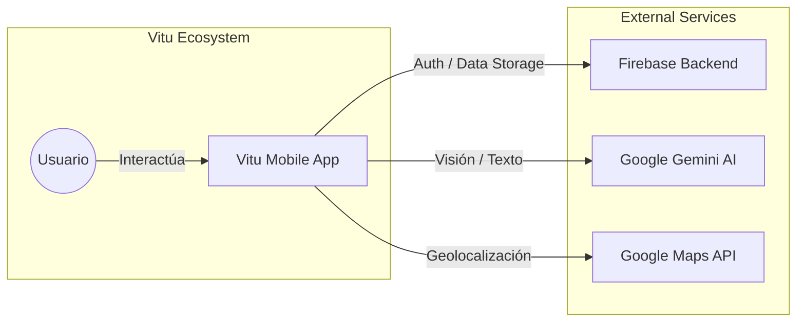
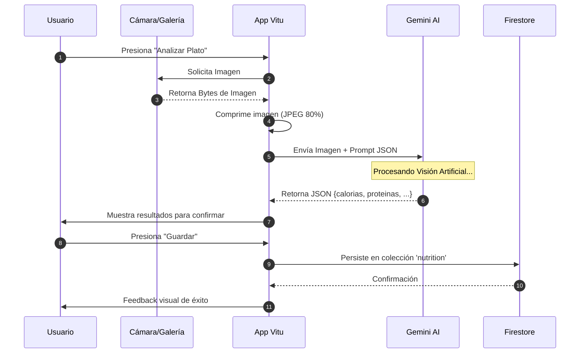
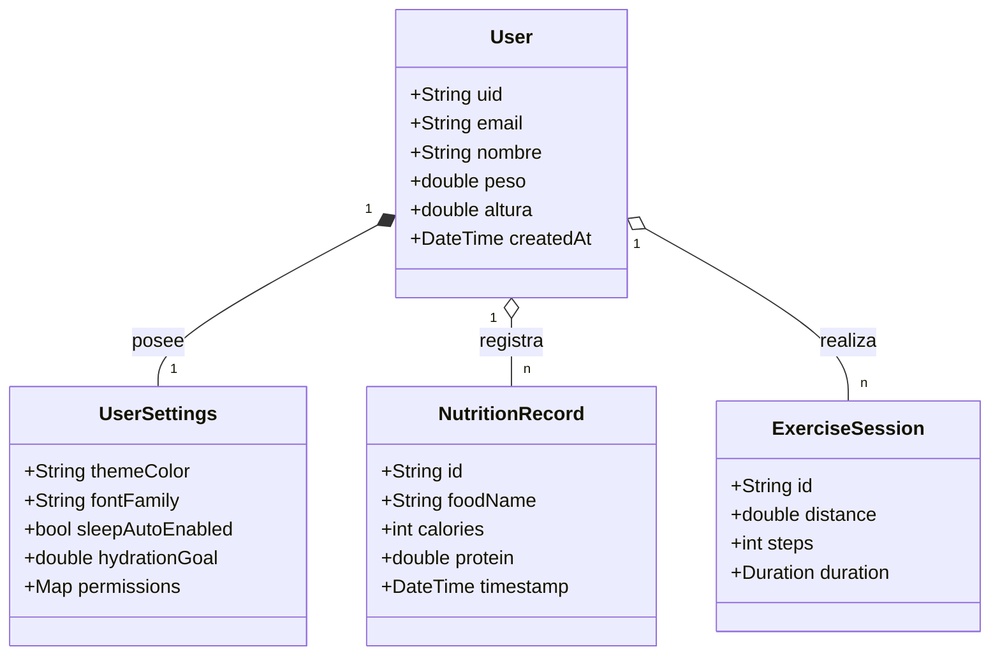
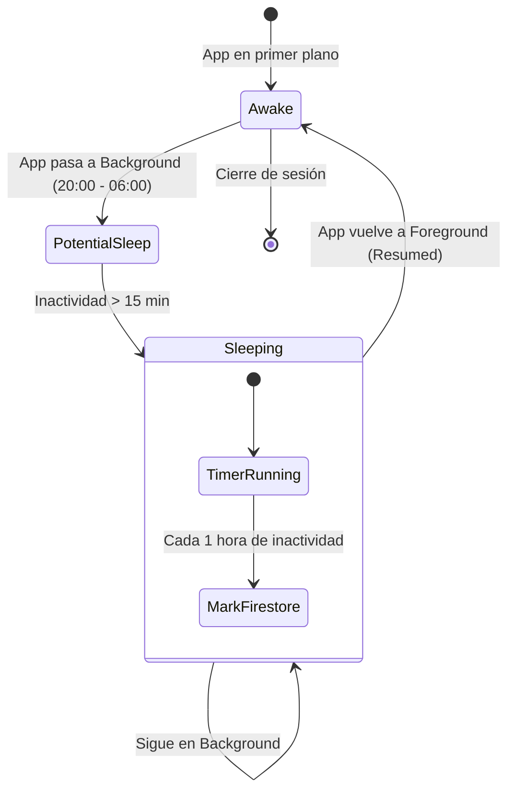

# 🌿 Vida Saludable (Vitu) - Documentación Técnica Maestra

<p align="center">
  
  <br>
  <b>Tu compañero inteligente para una vida plena y equilibrada.</b>
  <br>
  <i>Potenciado por Flutter, Firebase y Google Gemini AI.</i>
</p>

---

## 📖 1. Portada / Título

**Proyecto:** Vida Saludable (Vitu)  
**Versión:** 1.6.9 (Build 2) 
**Desarrollador:** Equipo de Desarrollo Vida Saludable  
**Fecha de última actualización:** 26 de Abril, 2026  
**Estado:** Producción / Estable  

**Vitu** es una ecosistema digital diseñado para transformar la gestión de la salud personal. A través de una interfaz moderna y fluida, la aplicación integra inteligencia artificial de vanguardia para ofrecer recomendaciones personalizadas, seguimiento automático de hábitos y un análisis profundo de la nutrición, el ejercicio y el sueño.

---

## 🌟 2. Introducción

### 2.1 Visión General
En un mundo cada vez más acelerado, mantener hábitos saludables se ha convertido en un desafío constante. **Vitu** nace de la necesidad de simplificar este proceso, eliminando la fricción de los registros manuales y proporcionando una visión holística de la salud del usuario.

### 2.2 Objetivos del Proyecto
1.  **Automatización**: Minimizar el esfuerzo del usuario en el registro de actividades (pasos, sueño, hidratación).
2.  **Inteligencia**: Utilizar modelos de lenguaje avanzados (LLMs) para analizar imágenes de alimentos y generar planes de nutrición personalizados.
3.  **Personalización**: Adaptar cada aspecto de la aplicación, desde la interfaz visual hasta los recordatorios, según el perfil y las necesidades del usuario.
4.  **Privacidad**: Garantizar que los datos biométricos y personales estén protegidos bajo los más altos estándares de seguridad en la nube.

### 2.3 Beneficios para el Usuario
- **Ahorro de Tiempo**: Registro de comidas mediante fotos en segundos.
- **Motivación Continua**: Visualización de progreso semanal mediante gráficas interactivas.
- **Salud Preventiva**: Detección de patrones de sueño y niveles de hidratación para prevenir enfermedades.
- **Guía Experta**: Acceso a sugerencias de ejercicios y recetas basadas en el perfil metabólico.

---

## ✨ 3. Características Principales

### 3.1 Nutrición Inteligente (Gemini Vision)
La sección de nutrición es el núcleo de la inteligencia de Vitu. No es solo un contador de calorías; es un nutricionista de bolsillo que utiliza visión artificial para simplificar la vida del usuario.

#### 3.1.1 Análisis Multimodal de Alimentos
Mediante el uso de la librería `google_generative_ai`, el usuario puede tomar una foto de su plato directamente desde la aplicación. 
- **Flujo Técnico**: 
  1. Captura de imagen con `ImagePicker`.
  2. Compresión de imagen para optimizar el ancho de banda.
  3. Envío de la imagen junto con un prompt de sistema estructurado a Gemini 1.5 Flash.
  4. Recepción de un JSON con el desglose de macronutrientes.
- **Beneficio**: Elimina la necesidad de buscar cada ingrediente manualmente en una base de datos, reduciendo el error humano y la fatiga del usuario.

#### 3.1.2 Generador de Recetas Personalizado
Vitu no solo te dice qué comiste, sino qué *podrías* comer.
- **Filtros Inteligentes**: El usuario puede especificar su presupuesto (Bajo, Medio, Alto), tiempo disponible y preferencias dietéticas.
- **Lógica de Generación**: El sistema construye un prompt dinámico que incluye el perfil del usuario (peso, altura, edad) para asegurar que la receta generada sea nutricionalmente adecuada.
- **Ejemplo de Prompt**: *"Genera una receta de cena para un usuario de 75kg que quiere perder peso, con un presupuesto de 5 USD y que se prepare en menos de 20 minutos."*

#### 3.1.3 Historial y Tendencias Nutricionales
Visualización clara de la ingesta calórica semanal mediante `fl_chart`. Los usuarios pueden ver de un vistazo si están cumpliendo con sus objetivos de macros a través de gráficos de pastel y barras.

### 3.2 Seguimiento de Ejercicio y Actividad Física
Diseñado para aquellos que buscan movimiento sin complicaciones técnicas, enfocándose en la simplicidad y la precisión basada en la ubicación.

#### 3.2.1 Algoritmo de Pasos por GPS (Inertial Tracking)
A diferencia de otras aplicaciones que dependen exclusivamente del acelerómetro (que puede dar falsos positivos al agitar el teléfono), Vitu utiliza un algoritmo basado en la geolocalización.
- **Lógica**: Se calcula la distancia euclidiana entre puntos de GPS capturados cada 5-10 segundos. 
- **Conversión**: Se aplica una constante de zancada promedio (0.75m para hombres, 0.67m para mujeres) para estimar los pasos.
- **Filtro de Ruido**: Se descartan movimientos a velocidades superiores a 25 km/h (vehículos) para mantener la integridad de los datos de ejercicio.

#### 3.2.2 Sesiones de Entrenamiento en Tiempo Real
Durante una caminata o carrera, el usuario recibe retroalimentación en tiempo real:
- **Ritmo (Pace)**: Minutos por kilómetro.
- **Distancia**: Total acumulado en metros/kilómetros.
- **Tiempo**: Cronómetro preciso sincronizado con el estado de la aplicación.

#### 3.2.3 Sugerencias de Rutinas Dinámicas
El sistema analiza el historial de actividad. Si el usuario ha sido sedentario durante 3 días, la aplicación prioriza sugerencias de "Estiramientos básicos" o "Caminata de 15 min" en la pantalla de inicio.

### 3.3 Gestión de Hidratación y Salud Hídrica
El agua es el pilar olvidado de la salud. Vitu le da el protagonismo que merece.

#### 3.3.1 Cálculo de Meta Personalizada
La meta no es un estándar de "2 litros para todos". Vitu utiliza la fórmula de hidratación basada en la masa corporal:
- **Fórmula**: `Peso (kg) * 35ml = Meta Diaria`.
- **Ajustes**: Se añaden 500ml adicionales por cada 30 minutos de ejercicio registrado en la aplicación.

#### 3.3.2 Sistema de Recordatorios Inteligentes
Utilizando `flutter_local_notifications`, la app programa alertas basadas en el consumo actual.
- **Lógica**: Si a las 2:00 PM el usuario no ha alcanzado el 40% de su meta, se dispara una notificación motivadora.
- **Personalización**: El usuario puede definir sus horas de sueño para que la aplicación no envíe alertas durante la noche.

### 3.4 Monitor de Sueño Autónomo (Vitu SleepGuard)
La característica más innovadora que funciona de forma silenciosa mientras tú descansas.

#### 3.4.1 Detección por Ciclo de Vida (AppLifecycle)
Vitu aprovecha los eventos del sistema operativo para inferir el sueño sin necesidad de sensores invasivos.
- **Evento**: Cuando el teléfono entra en estado de reposo profundo (la app pasa a `inactive` o `paused`) durante la ventana nocturna.
- **Validación**: El sistema espera un periodo mínimo de 20 minutos de inactividad para confirmar que no fue solo una consulta rápida al reloj.

#### 3.4.2 Ventana Nocturna Configurable
Por defecto configurada de 8:00 PM a 6:00 AM. El usuario puede ajustar esta ventana en la sección de ajustes para que coincida con su ritmo circadiano (trabajadores nocturnos, por ejemplo).

### 3.5 Personalización y Estética (Vitu Themes)
Una aplicación de salud debe ser placentera a la vista para fomentar el uso diario.

#### 3.5.1 Motor de Temas Material 3
- **Color Dinámico**: Implementación completa de `ColorScheme.fromSeed`. El usuario elige un "Color Semilla" y la aplicación genera automáticamente 32 variantes de color (Primary, Secondary, Tertiary, Container, etc.) que cumplen con los estándares de contraste WCAG.
- **Glassmorphism UI**: Uso intensivo de `BackdropFilter` y gradientes de opacidad baja para crear una interfaz moderna y aireada.

---

## 🏗️ 4. Arquitectura de la Aplicación

Vitu utiliza una **Arquitectura Modular por Capas** optimizada para la reactividad de Flutter. Esta arquitectura se inspira en los principios de *Clean Architecture* pero simplificada para agilizar el desarrollo y reducir el boilerplate.

### 4.1 Diagrama de Arquitectura de Alto Nivel (C4 Context Diagram)



### 4.2 Desglose de Capas

#### 4.2.1 Capa de Presentación (Presentation Layer)
Responsable de todo lo que el usuario ve y toca.
- **Widgets**: Componentes atómicos e independientes.
- **Screens**: Composiciones de widgets que representan una funcionalidad completa.
- **State Management**: Uso de `StatefulWidget` para estados efímeros y una combinación de Servicios Globales para estados compartidos.

#### 4.2.2 Capa de Servicios (Domain/Service Layer)
Donde reside la "magia" y la lógica de negocio.
- **IA Bridge**: Encargado de la comunicación con Gemini, formateo de prompts y limpieza de respuestas.
- **GPS Tracker**: Gestiona el flujo de coordenadas y los cálculos de distancia.
- **Sleep Watcher**: Implementa el observador del ciclo de vida del sistema.

#### 4.2.3 Capa de Datos (Data/Infrastructure Layer)
El puente con el mundo exterior.
- **Firebase Service**: Implementa el patrón *Repository*. Centraliza todas las llamadas a Firestore y Auth, gestionando errores de red y caché.
- **Local Cache**: Utiliza `SharedPreferences` para almacenar preferencias de usuario que deben estar disponibles instantáneamente al arrancar la app.

### 4.3 Flujo de Datos (Data Flow)
El flujo es unidireccional para evitar condiciones de carrera:
1. El usuario realiza una acción en la **UI**.
2. La UI llama a un método en la capa de **Servicios**.
3. El Servicio procesa la lógica y solicita persistencia a la capa de **Datos**.
4. La capa de Datos actualiza **Firebase**.
5. La UI escucha los cambios (vía Streams o Futures) y se actualiza automáticamente.

---

## 📁 5. Estructura del Proyecto

Una estructura organizada es la base de un código mantenible a largo plazo.

### 5.1 Árbol de Directorios Detallado

```mermaid
graph TD
    Root[lib/]
    Root --> BD[base_datos/]
    Root --> Models[modelos/]
    Root --> Screens[pantallas/]
    Root --> Services[servicios/]
    Root --> Widgets[widgets/]
    Root --> Utils[utils/]

    BD --> FirebaseSrv[firebase_service.dart]
    
    Models --> UserM[user.dart]
    Models --> SettingsM[user_settings.dart]
    Models --> RecipeM[receta.dart]
    Models --> ExerciseM[exercise_data.dart]

    Screens --> Ajustes[ajustes/]
    Screens --> Auth[auth/]
    Screens --> Exercise[ejercicio/]
    Screens --> Hydration[hidratacion/]
    Screens --> Home[inicio/]
    Screens --> Nutrition[nutricion/]
    Screens --> Sleep[sueno/]

    Services --> SleepS[sleep_auto_service.dart]
    Services --> NotifS[hydration_reminder_service.dart]
    Services --> IAService[gemini_service.dart]

    Widgets --> Common[common/]
    Widgets --> Cards[cards/]
    Widgets --> Layouts[layouts/]

    Utils --> Constants[constants.dart]
    Utils --> Helpers[helpers.dart]
```



### 5.2 Análisis de Archivos Críticos

| Archivo | Responsabilidad | Por qué es importante |
| :--- | :--- | :--- |
| `firebase_service.dart` | Orquestador de persistencia | Evita que la lógica de Firebase se disperse por toda la aplicación, facilitando el testing. |
| `user.dart` | Contrato de identidad | Define qué es un usuario en el ecosistema Vitu. Maneja la conversión de tipos NoSQL a objetos Dart fuertes. |
| `vida_plus_app.dart` | Punto de entrada UI | Gestiona el `MaterialApp`, las rutas y el motor de temas dinámicos. |
| `nutrition_screen.dart` | Interfaz de IA | Implementa la lógica de cámara y la integración visual con las respuestas de Gemini. |
| `sleep_auto_service.dart` | Inteligencia de fondo | Es el servicio que garantiza que el seguimiento de sueño funcione sin intervención del usuario. |

---

## 🛠️ 6. Stack Tecnológico

La elección de cada paquete en Vitu ha sido el resultado de un análisis de rendimiento y comunidad.

### 6.1 Framework y Lenguaje
- **Flutter 3.10.8**: Elegido por su excelente soporte de Material 3 y estabilidad en el canal estable.
- **Dart 3.0**: Aprovecha las nuevas capacidades de *Records* y *Pattern Matching* para un código más limpio en el parseo de JSON.

### 6.2 Backend y Cloud (Firebase)
- **Firebase Auth**: Manejo de identidad seguro y escalable.
- **Cloud Firestore**: Base de datos documental con soporte offline nativo, ideal para aplicaciones móviles.
- **Firebase Analytics**: Para entender el comportamiento del usuario y mejorar las funciones más utilizadas.

### 6.3 Inteligencia Artificial
- **Google Generative AI (Gemini 1.5 Flash)**: La versión Flash fue elegida por su baja latencia y alta eficiencia en tareas de visión y generación de texto estructurado.

### 6.4 Librerías de Terceros Clave
- **fl_chart**: La librería más potente para gráficos en Flutter. Permite animaciones fluidas y alta personalización.
- **geolocator**: Para un acceso preciso y eficiente al GPS con gestión automática de permisos.
- **connectivity_plus**: Permite a la app adaptar su comportamiento cuando no hay conexión a internet (modo offline parcial).
- **flutter_local_notifications**: Gestión robusta de alertas locales que funcionan incluso con la app cerrada.
- **image_picker**: Abstracción multiplataforma para el acceso a la cámara y galería.

---

## 📊 7. Diagramas de la Aplicación

### 7.1 Diagrama de Flujo de Usuario: Registro de Nutrición



### 7.2 Diagrama de Clases: Modelo de Datos



### 7.3 Diagrama de Estado: Seguimiento de Sueño



---

---

## 🚀 8. Instalación y Configuración

El proceso de despliegue de Vitu ha sido simplificado, pero requiere atención a los detalles de configuración de los servicios en la nube.

### 8.1 Requisitos del Sistema
- **Flutter SDK**: ^3.10.8 (Canal Stable)
- **Dart SDK**: ^3.0.0
- **Android Studio**: Jellyfish o superior (con SDK 34 instalado)
- **Xcode**: 15.0+ (para compilación iOS)
- **CocoaPods**: 1.12.0+

### 8.2 Configuración del Entorno de Desarrollo
1.  **Instalación de Flutter**: Sigue la [guía oficial](https://docs.flutter.dev/get-started/install) para tu sistema operativo. Asegúrate de que `flutter doctor` no muestre errores críticos.
2.  **Clonación del Repositorio**:
    ```bash
    git clone https://github.com/tu-usuario/VidaSaludable.git
    cd VidaSaludable
    ```
3.  **Obtención de Dependencias**:
    ```bash
    flutter pub get
    ```

### 8.3 Configuración de Firebase (Obligatorio)
Vitu no funcionará sin una instancia válida de Firebase.
1.  Crea un nuevo proyecto en [Firebase Console](https://console.firebase.google.com/).
2.  Agrega una aplicación **Android**:
    - Nombre del paquete: `com.example.vidasaludable` (o el que definas en `AndroidManifest.xml`).
    - Descarga `google-services.json` y muévelo a `android/app/`.
3.  Agrega una aplicación **iOS**:
    - Bundle ID: `com.example.vidasaludable`.
    - Descarga `GoogleService-Info.plist` y muévelo a `ios/Runner/` usando Xcode.
4.  Ejecuta `flutterfire configure` si tienes instalado el CLI de Firebase para sincronizar automáticamente los archivos de configuración.

### 8.4 Inyección de Secretos (Gemini API)
Por razones de seguridad, la API Key de Gemini no se incluye en el código fuente.
- **Opción A (Recomendada)**: Usar `--dart-define`.
  ```bash
  flutter run --dart-define=GEMINI_API_KEY=AIzaSy...
  ```
- **Opción B**: Crear un archivo `.env` en la raíz (requiere el paquete `flutter_dotenv` si decides implementarlo).

---

## ☁️ 9. Configuración de Firebase y Google Gemini

### 9.1 Cloud Firestore Setup
Vitu utiliza Firestore en modo nativo.
1.  **Base de Datos**: Crea la base de datos en la región más cercana a tus usuarios.
2.  **Colecciones Iniciales**: No es necesario crearlas manualmente; el `FirebaseService` las creará al primer registro, pero se recomienda definir los índices.
3.  **Índices Compuestos**:
    | Colección | Campos | Orden |
    | :--- | :--- | :--- |
    | `daily_exercise` | `userId`, `timestamp` | Ascending, Descending |
    | `hydration` | `userId`, `date` | Ascending, Descending |

### 9.2 Google AI Studio (Gemini)
1.  Accede a [Google AI Studio](https://aistudio.google.com/).
2.  Crea un nuevo "API Key".
3.  Verifica los límites de cuota (el plan gratuito permite hasta 15 RPM, suficiente para desarrollo).
4.  **Modelos Soportados**: Vitu está optimizado para `gemini-1.5-flash` por su velocidad de respuesta en dispositivos móviles.

---

## 🛡️ 10. Seguridad y Privacidad

### 10.1 Reglas de Seguridad de Firestore
Para garantizar que los usuarios solo accedan a sus propios datos, aplica estas reglas:
```javascript
rules_version = '2';
service cloud.firestore {
  match /databases/{database}/documents {
    // Función auxiliar para verificar propiedad
    function isOwner(userId) {
      return request.auth != null && request.auth.token.email == userId;
    }

    match /users/{userId} {
      allow read, write: if isOwner(userId);
    }
    
    match /user_settings/{userId} {
      allow read, write: if isOwner(userId);
    }
    
    match /hydration/{docId} {
      allow read, write: if request.auth != null && docId.split('_')[0] == request.auth.token.email;
    }
  }
}
```

### 10.2 Privacidad de Ubicación
- **Geofencing**: Vitu solo procesa la ubicación mientras una sesión de ejercicio está activa.
- **Anonimización**: Los datos de pasos se guardan como enteros, eliminando las coordenadas precisas después de procesar la distancia para proteger la privacidad del hogar del usuario.

---

## 💡 11. Mejores Prácticas Aplicadas

### 11.1 Patrones de Diseño
- **Singleton**: El `FirebaseService` se implementa como un Singleton para asegurar una única conexión a la base de datos.
- **Factory**: Los modelos usan `factory constructors` para una creación de objetos segura a partir de mapas de Firestore.
- **Observer**: `SleepAutoService` observa el ciclo de vida de la aplicación de forma reactiva.

### 11.2 Calidad de Código
- **Linter**: Se utiliza `flutter_lints` con reglas personalizadas para evitar el uso de `print` en producción y asegurar el uso de `const` donde sea posible.
- **Tipado Fuerte**: Evitamos el uso de `dynamic` siempre que sea posible, prefiriendo interfaces y tipos genéricos.

---

## 🗺️ 12. Roadmap Futuro

### Fase 1: Integración con Ecosistemas (Q3 2026)
- Sincronización bidireccional con **HealthKit** (iOS) y **Google Fit** (Android).
- Soporte para **Android Wear** y **Apple Watch**.

### Fase 2: Social y Gamificación (Q4 2026)
- Grupos de salud familiares.
- Retos mensuales con recompensas virtuales.
- Tablas de clasificación anónimas.

### Fase 3: IA Avanzada (Q1 2027)
- Análisis de fotos de etiquetas nutricionales (OCR).
- Predicción de fatiga basada en patrones de sueño y ejercicio.
- Chatbot de soporte emocional y motivacional.

---

## 🤝 13. Cómo Contribuir

¡Vitu es un proyecto abierto y damos la bienvenida a todos los desarrolladores!

### 13.1 Proceso de Pull Request
1.  **Issues**: Antes de trabajar en algo grande, abre un Issue para discutirlo.
2.  **Estilo de Código**: Sigue las guías de estilo de Dart. Ejecuta `dart format .` antes de enviar.
3.  **Documentación**: Si añades una nueva característica, actualiza este README.
4.  **Tests**: Asegúrate de que los tests existentes pasen ejecutando `flutter test`.

### 13.2 Áreas de Interés
- Optimización de algoritmos de GPS.
- Traducción a más idiomas (i18n).
- Mejora de los prompts de Gemini para mayor precisión nutricional.

---

## 📜 14. Licencia y Créditos

### Licencia
Este proyecto está bajo la **Licencia MIT**. Esto significa que eres libre de usarlo, modificarlo y distribuirlo, siempre que mantengas el aviso de copyright original.

### Créditos y Agradecimientos
- **Google Cloud**: Por las becas de créditos para el uso de Gemini AI.
- **Comunidad Flutter**: Por los increíbles paquetes de código abierto que hacen posible este proyecto.
- **Diseñadores de Lucide**: Por los iconos minimalistas y modernos.

---

## 📚 15. Referencias y Recursos

### Documentación Oficial
- [Flutter Documentation](https://docs.flutter.dev/) - La fuente definitiva para el desarrollo con Flutter.
- [Firebase Documentation](https://firebase.google.com/docs) - Guías completas para Firestore y Auth.
- [Gemini API Cookbook](https://github.com/google-gemini/cookbook) - Ejemplos avanzados de uso de IA.

### Tutoriales Recomendados
- [Clean Architecture en Flutter](https://resocoder.com/flutter-clean-architecture-tdd/) - Conceptos avanzados de arquitectura.
- [Material Design 3 Guide](https://m3.material.io/) - Principios de diseño moderno.

---
<p align="center">
  <b>Vitu - Innovación para tu Bienestar</b><br>
  Hecho con ❤️ por apasionados de la tecnología y la salud.
</p>
